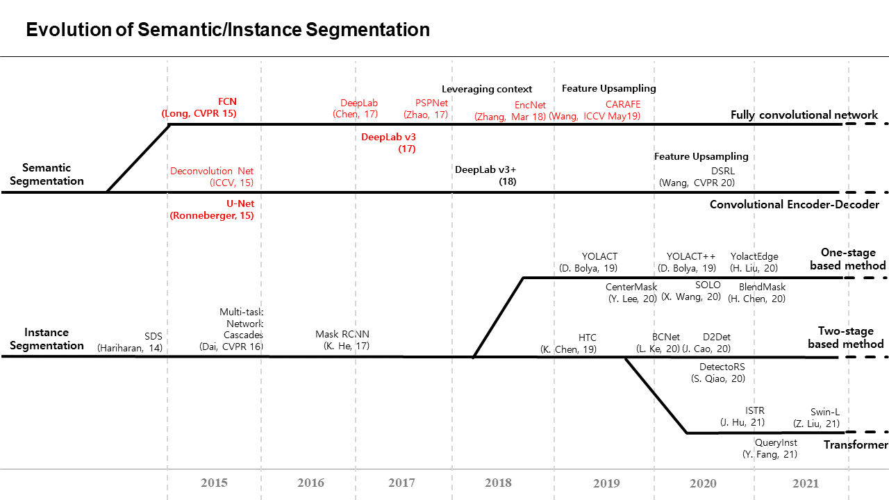
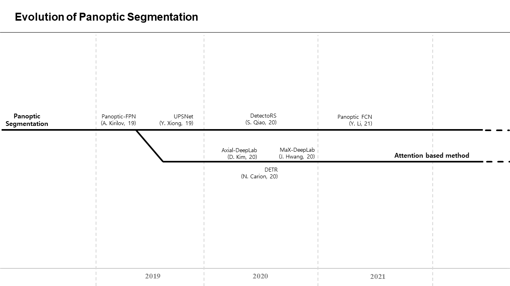
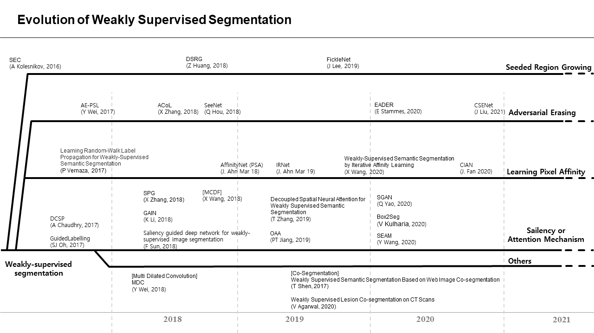
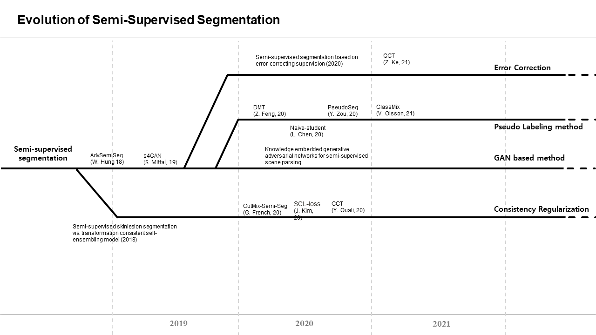

# Survey

Review By: 김현우, 송태엽

## Semantic/Instance Segmentation

## Panotic Segmentation

## Weakly-Supervised learning based Segmentation

## Semi-Supervised learning based Segmentation

 

*Latest update: Oct, 2021*
