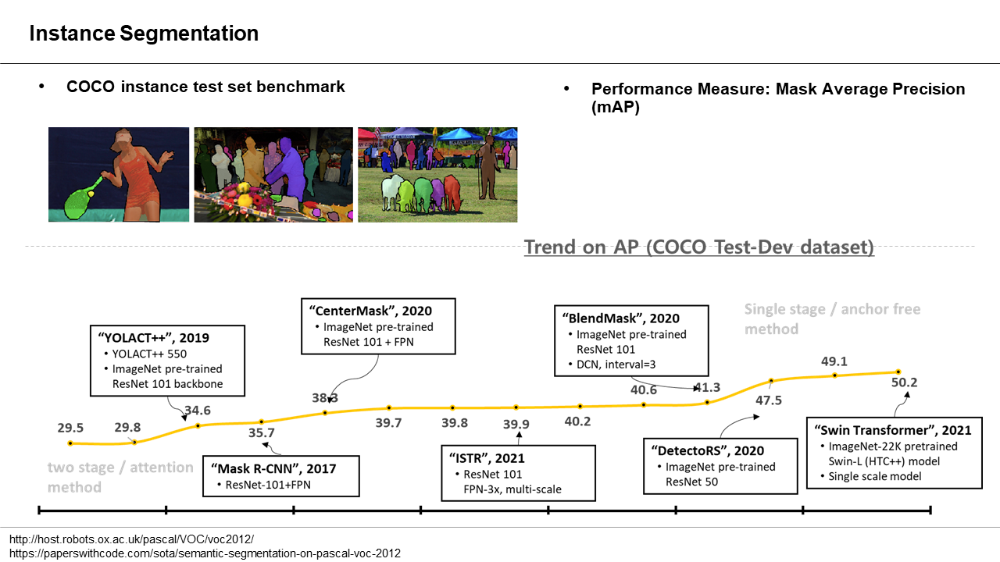

# Reading List: Instance Segmentation

- [SDS] Simultaneous Detection and Segmentation, ECCV 14 ([paper](https://arxiv.org/abs/1407.1808), code, review)
- **[Mask R-CNN] Mask R-CNN , ICCV 17 (paper, code, review)**
- [PANet] 2018
- [YOLACT] YOLACT: Real-time Instance Segmentation,  ICCV 19 ([paper](https://www.google.com/url?sa=t&rct=j&q=&esrc=s&source=web&cd=&ved=2ahUKEwixndaNu9nwAhU8yIsBHUctDb0QFjABegQIBRAD&url=https%3A%2F%2Farxiv.org%2Fabs%2F1904.02689&usg=AOvVaw2E2g5GFyvp4UHKD3DC1ond), [code](https://github.com/dbolya/yolact), review)
- [YOLACT++] YOLACT++: Better Real-time Instance Segmentation, 2019 ([paper](https://www.google.com/url?sa=t&rct=j&q=&esrc=s&source=web&cd=&cad=rja&uact=8&ved=2ahUKEwjc75LSu9nwAhXEJKYKHY1oCT8QFjAAegQIAxAD&url=https%3A%2F%2Farxiv.org%2Fabs%2F1912.06218&usg=AOvVaw3L_d1cbyEvVN01uEBpx14X), [code](https://github.com/dbolya/yolact), review)
- [CenterMask] CenterMask : Real-Time Anchor-Free Instance Segmentation, CVPR 20 ([paper](https://arxiv.org/abs/1911.06667), [code](https://github.com/youngwanLEE/CenterMask), code2, review)
- [HTC] Hybrid Task Cascade for Instance Segmentation, CVPR 19 ([paper](https://arxiv.org/abs/1901.07518), code, review)
- [SOLO] SOLO: Segmenting Objects by Locations, ECCV 20 ([paper](https://arxiv.org/abs/1912.04488), [code](https://github.com/WXinlong/SOLO), review)
- [YolactEdge] YolactEdge: Real-time Instance Segmentation on the Edge, 2020 ([paper](https://arxiv.org/abs/2012.12259), [code](https://www.google.com/url?sa=t&rct=j&q=&esrc=s&source=web&cd=&cad=rja&uact=8&ved=2ahUKEwi8ytrtu9nwAhXsyYsBHXAgAWAQFjAAegQIBBAD&url=https%3A%2F%2Fgithub.com%2Fhaotian-liu%2Fyolact_edge&usg=AOvVaw3Mw250SG4Z6B9ArPhWQepo), review)
- [CPMask] Commonality-Parsing Network across Shape and Appearance for Partially Supervised Instance Segmentation, ECCV 20 ([paper](https://arxiv.org/pdf/2007.12387v1.pdf), [code](https://github.com/fanq15/FewX), review) ㅁ
- [BCNet] Deep Occlusion-Aware Instance Segmentation with Overlapping BiLayers, 2020 ([paper](https://arxiv.org/pdf/2103.12340v1.pdf), [code](https://github.com/lkeab/BCNet), review)
- [D2Det] D2Det: Towards High Quality Object Detection and Instance Segmentation, CVPR 20 ([paper](http://openaccess.thecvf.com/content_CVPR_2020/papers/Cao_D2Det_Towards_High_Quality_Object_Detection_and_Instance_Segmentation_CVPR_2020_paper.pdf), [code](https://github.com/JialeCao001/D2Det), review)
- [BlendMask] BlendMask: Top-Down Meets Bottom-Up for Instance Segmentation, CVPR20 ([paper](https://arxiv.org/abs/2001.00309), code, review)
- [SOLOv2] SOLOv2: Dynamic and Fast Instance Segmentation, NeurIPS 20 (paper, code, review) ㅁ
- [DetectoRS] DetectoRS: Detecting Objects with Recursive Feature Pyramid and Switchable Atrous Convolution, 2020 ([paper](https://arxiv.org/pdf/2006.02334v2.pdf), [code](https://github.com/joe-siyuan-qiao/DetectoRS), review)
- [ISTR] ISTR: End-to-End Instance Segmentation with Transformers, 2021 ([paper](https://arxiv.org/abs/2105.00637), code, review) ㅁ
- [QueryInst] Instances as Queries, 2021 ([paper](https://arxiv.org/pdf/2105.01928v3.pdf), [code](https://github.com/hustvl/QueryInst), review) ㅁ
- [Swin-L] Swin Transformer: Hierarchical Vision Transformer using Shifted Windows, 2021 ([paper](https://arxiv.org/pdf/2103.14030v1.pdf), [code](https://github.com/SwinTransformer/Swin-Transformer-Semantic-Segmentation), review) ㅁ

*Latest update: Oct, 2021*