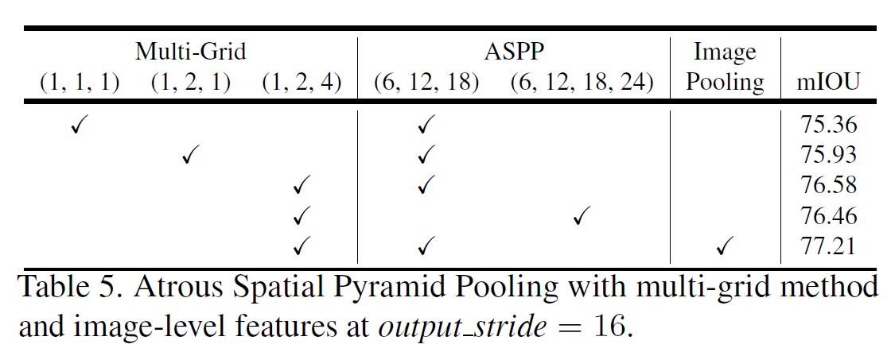

# Rethinking Atrous Convolution for Semantic Image Segmentation

Review By: Geonsoo Kim, jooeun kim, 김동현­, Seongsu Park, 김한중­, Yejin Kim, Junmyeong Lee (가짜연구소 논문미식회 2기)

Edited by: Taeyup Song

## Background

- Semantic segmentation
: 영상을 의미적/인지적 관점에서 서로 비슷한 영역으로 구분
: pixel level classification

    

## Related Works

### 1. FCN for Semantic Segmentation

 [[FCN] Fully Convolutional Networks for Semantic Segmentation](https://www.notion.so/FCN-Fully-Convolutional-Networks-for-Semantic-Segmentation-81950953fe854bae833d2025db92c994) 

- Image Classification에 적용된 CNN 모델을 변형하여 semantic segmentation 수행

    → ConvNet을 이용하여 특징(feature)를 추출과정은 동일

    → Image classification 모델의 Output layer를 1x1 convolution으로 변경

    :  feature의 spatial information을 유지

    : 입력 영상의 크기에 무관한 semantic segmentation 수행

    → output model output을 upsample하여 원본과 동일한 크기의 segmentation 결과를 도출

- ConvNet은 layer가 깊어질 수록 pooling/stride에 의해 spatial dimension이 작아지기 때문에 output을 upsample 하는 과정에서 디테일이 손상될 수 있음
- 이를 보완하기 위해 ConvNet의 layer의 output에서 segmentation을 수행하고 결과를 sum하는 과정을 거침. (FCN-32s, FCN-16s, ...)

### 2. DeepLab

- DeepLab v1 - atrous convolution 및 Conditional Random Field(CRF) 도입
- DeepLab v2 - A*trous spatial pyramid pooling* (ASPP) 이용하여 다양한 크기의 객체에 대응
- DeepLab v3 - encoder에 ResNet 구조 도입. ASPP를 보완하고, batch norm. 사용하여 학습이 잘 되도록 함.  CRF 없이 동등 이상 성능 확보
- DeepLab v3+: Depth-wise seperable Conv.도입하여 런타임 속도 개선. (ASSPP) U-Net 구조를 단순화한 Decoder 구조 사용하여 성능 개선

### 3. Conditional Random Field

[Conditional Random Field](https://www.notion.so/Conditional-Random-Field-8f5f9c9a446a4fb38a225125352ee338) 

---

## Problem Statement

1. DNN을 이용한 Semantic Segmentation은 pooling 또는 stride를 이용하기 때문에 encoder의 level이 깊어질수록 spatial한 info를 잃어버리고, layer 수를 늘리는데 한계가 존재함.
2. multi-scale에 대응하기 어렵고, 기존 방법 (DeepLab)에서는 후처리에 Dense-CRF를 적용하여 속도가 느림
3. DeepLab v2에서 제안된 ASPP module의 경우 multi-scale context를 잘 추출했지만 Atorus rate가 커질수록 유효한 weight의 수가 작아지는 경향을 보임. ⇒  Atorus rate가 커지면 3x3 kernel이 1x1처럼 동작함.

## Contribution

1. DeepLab v2에 적용된 ASPP module의 degenerate 문제 개선 (last feature map에 Global Average Pooling 추가) 
2. Batch normalization 도입하여 성능 개선.

---

## Proposed Method

### 1. **Cascade Atrous Convolution for Dense Feature Extraction**

- A**trous Convolution (=Dilated Convolution)**

    [Atrous Convolution](https://www.notion.so/Atrous-Convolution-2566ee470d6a4b47889f18aad5166982) 

    **:** Kernel의 성분들 사이에 빈 성분(0)을 삽입하여 convolution을 수행

    : Dilation rate는 빈 성분(0)을 몇 개 삽입할지 결정. 기존 일반적인 convolution의 dilation rate=1. dilation rate=2일 경우는 성분들 사이에 빈 성분(0) 1개 추가, 3일 경우는 2개 추가, ...

    : 기존 3x3 Kernel에 아래와 같이 dilation rate=2를 사용하면 field-of-view(receptive field)가 5x5의 영역을 커버하게 됨. 

    : x: input feature map, w: filter, r: dilation rate, y: output일 때 

$$y[i]=\sum_{k}^{K}x[i+r\cdot{k}]w[k]$$

2D Convolution

**Atrous Convolution**

- A**trous convolution은 pooling 연산 없이 넓은** field of view를 커버할 수 있음.
(기존 CNN의 경우 넓은 field of view를 커버하기 위해 conv. pooling을 사용하여 output feature map의 해상도가 감소. )

- Multi-grid Method

    :  Atrous Convolution의 rate를 변형하여 padding 및 stride를 최소화

 layer 4부터 atrous rate를 2,4,8로 조절하여 output layer의 stride를 16으로 유지

### 2. Atrous Spatial Pyramid Pooling (ASPP)

[Atrous Spatial Pyramid Pooling](https://www.notion.so/Atrous-Spatial-Pyramid-Pooling-cdb0e7b83228427592f97d717645f58e) 

- 초기 Object Detection에 적용된 SPPNet의 Idea 차용 Atrous Conv.로 구성한 SPP 구성

    → ConvLayer의 output을 다양한 Atrous rate를 가지는 kernel을 병렬로 연산하여 multi-scale 특징을 추출하고자 함.

- Atrous rate가 커질수록 유효한 weight의 수가 작아지는 경향을 보임.

    ⇒  Atorus rate가 커지면 3x3 kernel이 1x1처럼 동작함.

    ⇒ large scale context는 output에 반영 안됨. (receptive field를 크게 만들고 싶은데 안됨..)

5x5 feature map 과 Atrous rate = 4 인 3x3 dilated kernel 의 예시. Valid weight의 개수가 중앙 영역에 대해서는 1x1으로 줄어듬.

- 이런 degenerate 문제 해결을 위해 이미지의 last feature map에 대해서 "Global average pooling"을 적용.
- 성능 개선을 위해 각 module에 batch normalization 적용

Global average Pooling + 1x1 Convolution module을 거친 후, Bilinear upsampling을 적용하여 입력 크기의 segmentation result 도출

- Global average Pooling + 1x1 Convolution module을 거친 후, Bilinear upsampling을 이용하여 image-level feature map을 다시 원하는 해상도로 복원하는 과정을 거친다.

---

## Experimental Evaluation

### 1. Training Protocol

[DeepLab v3 Training Protocol](https://www.notion.so/DeepLab-v3-Training-Protocol-60f24984cb7341c98345ca96cbb71e19)

- Pre-trained Model: ImageNet-Pretrained ResNet
- Dataset
a) PASCAL VOC 2012
- Learning rate

    : poly learning rate policy (초반엔 선형 감소에 가깝지만, Training step의 마지막에서는 조금 더 가파르게 감소하는 경향성을 보임)

$$\left( 1-\frac{iter}{max_iter}\right)^{power}$$

- Crop Size

    : 학습 과정에서 train set을 crop하여 사용할 때, Atrous conv.를 효과적으로 사용하기 위해 큰 size로 crop하여 training해 줄 필요가 있음 
    → feature map size가 커지는 효과가 있으므로, kernel들의 valid weight 또한 커지고, 효과적인 학습이 가능)

    : 513x513 size의 이미지로 cropping

- Batch Normalization

    : Batch normalization training을 위해서는 Batch size가 클 필요가 있음.
      → 통계적으로 보았을 때, 큰 batch size를 사용할 경우, batch에 따른 statistics변화가 작아진다.
     → BN 자체가 batch 단위의 statistics를 이용하여 학습하는 것이므로, 안정적인 학습을 위해서는 batch size가 큰 것이 좋다. 

- Upsampling logits

    : 이전 방법은 GT image를 final result의 크기에 맞게 downsampling함.

    : 하지만, 이 방법은 GT image의 fine detail을 손상시키기 때문에 network가 detail을 표현하는 방법을 학습하지 못하게 됨.

    : DeepLab v3에서는 final result를 GT image에 맞게 upsampling하여 오차를 구함.

- Data augumentation

    : Input image를 랜덤하게 scaling(0.5~2.0배)

    : Randomly left-right flipping

### 2. Experimental Result

- PASCAL VOC 2012 semantic segmentation benchmart 이용 성능 평가 (train 1,464장, val 1,449장, test 1,456장)
- Multi-Grid (1,2,4) + ASPP (6, 12, 18) + Image Pooling 조합이 mIOU 77.21%로 가장 좋은 성능을 나타냄.

    Cascaded atrous convolution module 보다 ASPP를 적용했을 때 더 높은 성능을 나타냄. 

    

### 3. 추가 실험 : DeepLab v2와의 비교

- DenseCRF post-processing, MS-COCO pre-training scheme을 적용하지 않았음에도 불구하고, DeepLab v2 대비 성능 개선 확인 (DeepLab v2 : 77.69%)
- 이러한 성능 향상은 크게 두 가지 contribution에 의한 것으로 보인다.
    1. Batch normalization의 추가, fine-tuning에 의한 성능 향상
    2. Global average pooling의 추가로 인한 multi-scale context 활용 성능 향상

