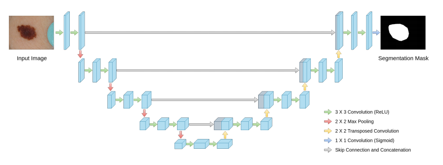
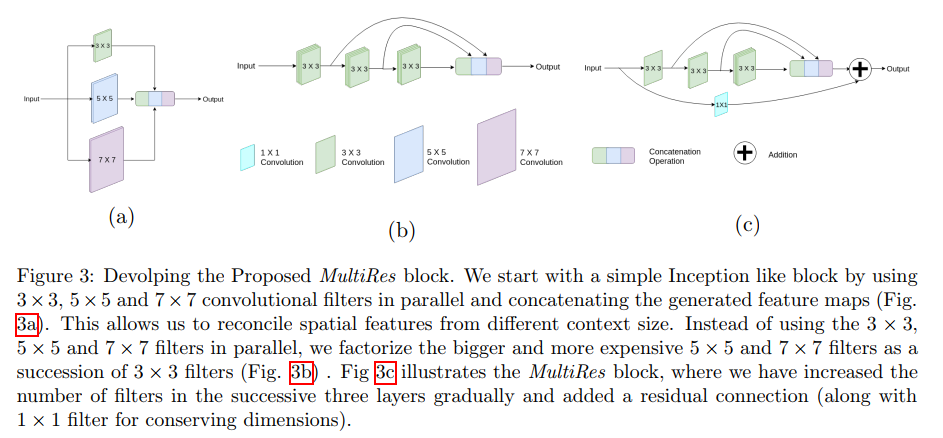
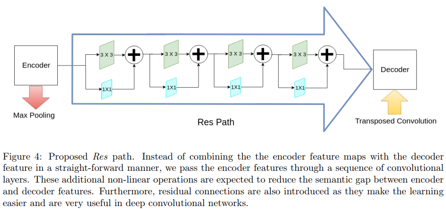
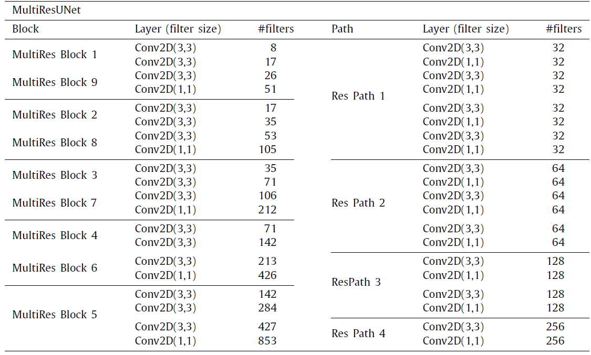

# MultiResUNet : Rethinking the U-Net Architecture for Multimodal Biomedical Image Segmentation

Review By: Taeyup Song (가짜연구소 논문미식회 2기)

Edited by: Taeyup Song

## Resource

- [https://arxiv.org/abs/1902.04049](https://arxiv.org/abs/1902.04049)
- [https://medium.com/@sh.tsang/review-multiresunet-rethinking-u-net-biomedical-image-segmentation-4f0f21a4ed84](https://medium.com/@sh.tsang/review-multiresunet-rethinking-u-net-biomedical-image-segmentation-4f0f21a4ed84)
- [https://github.com/nibtehaz/MultiResUNet](https://github.com/nibtehaz/MultiResUNet)

## Conventional Method: U-Net

- semantic segmentation에 주로 사용되는 encoder-decoder structure에 skip-connection 적용
- Pooling layer에서 소실되는 spatial info.를 retrieve해줌

## Proposed Method

### 1. U-Net 구조 개선

medical imaging 분야에서 잘 쓰이던 U-Net을 최신 architecture를 적용해서 개선

1. Multi-resolution analysis (figure a)
→ inception-like block을 도입
→ stride conv.를 적용할 수 있으나 U-Net archi에 의해 효과가 없었음. 
→ memory를 너무 낭비함.
2. 5x5, 7x7 conv를 3x3의 조합으로 구성. (figure b)
→ 그래도 memory를 많이 씀
→ conv가 2개가 연결되면 memory는 quadratic effect를 줌 (제곱이 됨?)
3. **2구조에 skip-connection 적용 (MultiRes block)**

### 2. Probable Semantic Gap between the Corresponding Levels of Encoder-Decoder

- U-net에서 encoder의 처음 layer 정보는 decoder의 마지막 layer로 전달됨.
- 이 과정에서 발생할 수 있는 spatial information loss를 줄이기 위해 추가적인 non-linear transformation이 필요하며, residual connection이 포함된 conv layer(ResPath)를 추가하여 학습을 쉽게 할수도 있음. [33, 39]
- 논문에서는 3x3 conv 사용

### 3. Proposed Architecture

각  block 내의 convolutional layer filter 수를 기존 U-Net와 유사하게 control 하기 위해 W parameter를 도입

$$W=\alpha\times U$$

$U$ is the # of filters in the corresponding layer of the U-Net
$\alpha$ is a scalar coefficient.

논문에서는 $\alpha=1.67$적용

