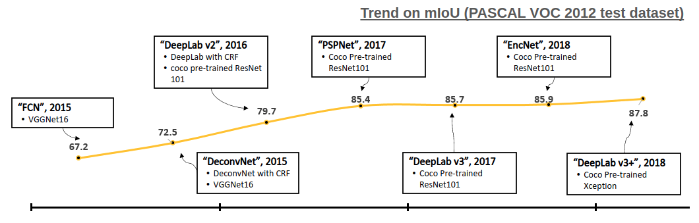

# 01. Semantic Segmentation

## Introduction

- Semantic segmentation이란 영상을 의미적/인지적 단위로 구분하여 분할하는 기술을 의미한다. 이는 각 pixel이 어떤 semantic을 가지는지 분류하는 pixel level classification 문제로 해석할 수 있으며, 모든 pixel에 대한 prediction을 수행하기 때문에 dense prediction으로 불리우기도 한다. 

:::{figure-md} markdown-fig

Semantic Segmentation \
(source: https://tariq-hasan.github.io/concepts/computer-vision-semantic-segmentation/)
:::

- VGG, ResNet과 같은 classification task를 위한 network는 입력영상에 대해 convolution layer와 pooling layer를 단계적으로 거치며, feature를 추출한다. 

- Pooling layer는 입력되는 feature map을 축소시는 과정으로 큰 receptive field를 갖도록 하여 점진적으로 전역적인 특징을 (global feature)를 추출할 수 있도록 고안되어 있지만, feature의 resolution 역시 줄어들기 때문에 segmentation task에는 필연적으로 정보의 손실을 야기한다. 

- 또한 classification network의 마지막 layer에서는 global average pooling(GAP) 또는 fully connected layer(FCN) 등을 이용하여 목표 class 수 만큼 node를 축소한 후 one-hot encoding을 통해 최종 classification 결과를 도출하는 과정을 거치게 되는데, 이 과정에서 위치별 activation이 소실되기 때문에 dense prediction을 수행할 수 없게된다. 

+++

- 2014년에 classification task를 위해 학습된 VGG network의 마지막 layer를 1x1 convolution layer으로 교체하여 위치 정보가 포함된 activation을 추출한 후 이를 upsample하는 방법인 FCN(Title: Fully Convolutional Network for Semantic Segmentation)가 제안되면서 이를 기반으로 다양한 semantic segmentation architecture가 제안되었다. 

:::{figure-md} markdown-fig

Comparison of a CNN for classification (top) and a FCN which creates a heat map (bottom) (source: arXiv:1511.00513)
:::

- Neural network, 특히 convolutional neural network(CNN)을 이용한 sementic segmentation을 구성하기 위해 고려해야할 사항은 다음과 같다. 

    (1) 넓은 receptive field를 유지하면서 고해상도 feature를 추출하기 위한 architecture 설계 

    (2) 원본과 동일한 segmentation 결과를 얻기 위한 upsample 방법의 선택
    
## Performance Measure

- Semantic Segmentation의 성능 평가 지표로 가장 일반적으로 사용되는 지표는 IoU(Intersection-over-Union) 이다. 

:::{figure-md} iou-fig

Intersection-over-Union (source: Wikipedia)
:::

- Jaccard 인덱스라고도 하는 IoU는  predict한 segmentation과 ground truth 간의 중첩 영역을 합집합 영역으로 나눈 것이다. 범위는 0–1(0–100%)이며 0은 겹치지 않음을 나타내고 완벽하게 segmentation된 경우 1을 나타낸다

$$\text{IoU}=\frac{\text{TP}}{\text{TP}+\text{FP}+\text{FN}}$$

- Image segmentation task의 경우 각 class 별로 IoU를 계산 후 평균을 취한 mIoU(mean IoU)를 평가 지표로 활용한다. 

## Trend

:::{figure-md} performance

Evolution of Semantic Segmentation
:::

- {numref}`Fig. %s <performance>`는 PASCAL VOC 2012 test set으로 평가한 semantic segmentation 성능이다. 
- PASCAL VOC 2012는 20개의 object classes와 background class로 구성되어 있으며,  pixel단위의 labed이 존재하는 train DB 1,464장, validation 1,449장 그리고 test 1,456 장으로 구성되어 있다. 

+++

- 본 chapter에서는 semantic segmentation 논문을 i) fully convolutional network 기반 방법과 ii) convolutional encoder-decoder 방법으로 구분하여 리뷰하고 각 지금까지의 발전 현황과 개선방안에 대해 고찰한다. 

*Latest update: Jan 6, 2022*