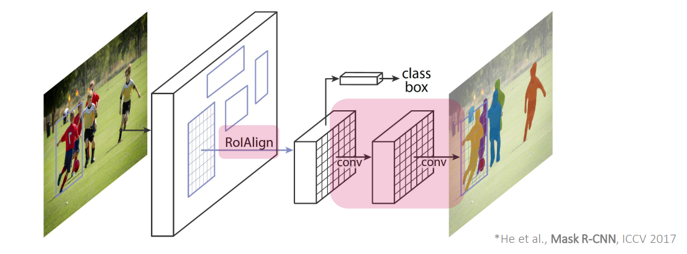
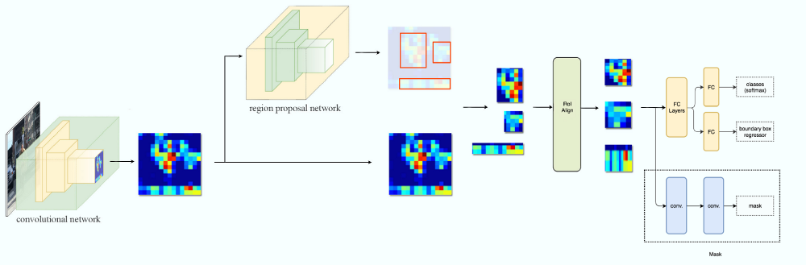
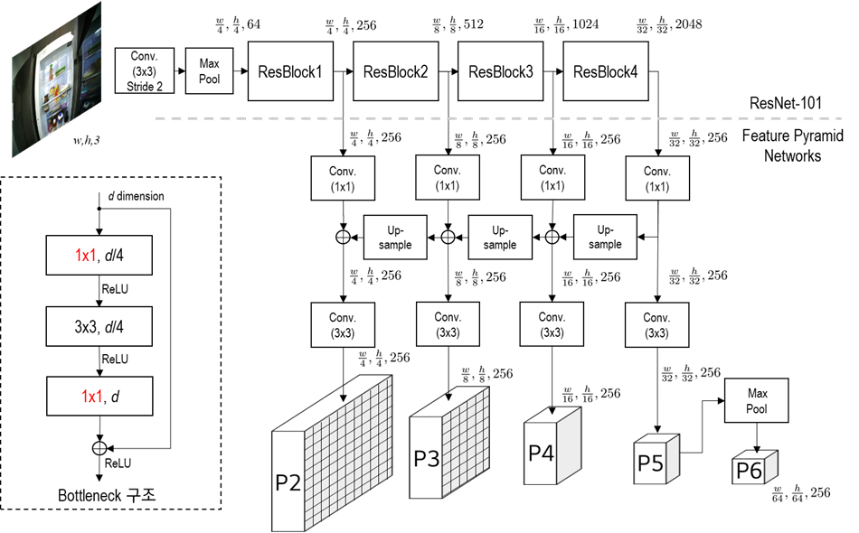
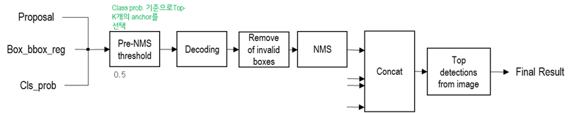

# Mask R-CNN - ICCV 2017

---

- **Title:** Mask R-CNN

- **Review By:** Hwigeon Oh

- **Edited by:** Taeyup Song

---

## Reference

- paper : [https://arxiv.org/abs/1703.06870](https://arxiv.org/abs/1703.06870)
- code : [https://github.com/matterport/Mask_RCNN](https://github.com/matterport/Mask_RCNN)

## Contribution

- Faster R-CNN을 확장한 network를 이용하여 instance segmentation 수행
    - RPN, detection head에 추가로 mask head가 추가된 구조로 bounding box에 대해 mask prediction 추가로 수행 (각 bounding box에 대해 mask prediction 수행)
    - classification, bbox regression, segmentation이 병렬로 구성되어 학습로직 구성이 쉬움
- ROI pooling을 개선한 ROI Align 제안
    - ROI pooling과 달리 quantization없는 방법으로 pooling 과정을 정교하게 수행하여 segmentation 성능을 개선.

:::{figure-md} markdown-fig


The Mask R-CNN framework (source arXiv:1703.06870)
:::


## Architecture

- classification, bbox regression, segmentation이 병렬로 구성한 end-to-end train 구조
- class, bbox와는 분리해서 독립적으로 segmentation mask를 구성 
- Translation/Scale equivalent를 유지하도록 설계함.
    - Convolution, FCN: translation equivalent
    - ConvNet: translation-invariant 
    (Pooling을 통해 feature map의 resolution을 축소하는 과정에서 translate에 대한 효과가 감소한다고 알려져 있음)
    - ROI Align: scale equivalent 하다고 주장
    - FPN: scale-equivariance
- Bounding Box 내 object의 mask에 집중하여, ROI 내 작은 변화에 대해서만 equivalent를 유지하는 것이 목표 


:::{figure-md} markdown-fig


Architecture (image from https://medium.com/@jonathan_hui/image-segmentation-with-mask-r-cnn-ebe6d793272)
:::

### 1. Feature Extraction

- ResNet-50 또는 ResNet-101 backbone 사용
    - 입력 영상을 1024x1024x3으로 resize (bilinear interpolation)
    - ResNet의 경우 800~1024크기의 입력을 사용하는 것이 가장 좋다고 알려져 있음
- FPN 구조로 5단계  feature map 추출
    - ResNet backbone의 경우 feature map은 $[4, 8, 16, 32, 64]$의 stride를 가짐. 
    - 입력영상 대비 $[1/4, 1/8, 1/16, 1/32, 1/64]$배 크기의 feature map이 생성됨. 

:::{figure-md} markdown-fig


Feature Extraction
:::

### 2. Region Proposal Network

- Faster R-CNN과 동일한 구조
    - 모든 pyramid level의 feature map에 대해 Region proposal 추출
    - anchor는 3종류 사용 → FPN으로 scale에 대한 대응 가능
- Implementation
    - 저자의 code에서는 최대 크기의 입력 영상 $(1024, 1024, 3)$에 대해 다음과 같이 anchor를 생성해서 사용함.
    
      - anchor의 크기는 각 feature map level에 따라 각 feature 위치를 중점으로 
        $[32, 64, 128, 256, 512]$ 크기로 생성함.
      - Anchor stride를 1로 설정하여 모든 feature point에서 3가지 종류의 anchor 생성
      - Anchor scale로 normalize한 후 return
      

:::{figure-md} markdown-fig


Region Proposol Network (RPN)
:::
  
  - Cls lauer→ 각 anchor에 대해 가장 높은 IoU를 가지고, $IoU$ 0.7 이상 box는 object, $IoU$ 0.3 이하는 배경으로 선택
    - 최종 output dim.: $w/i \times h/i \times \text{(anchor 수)}$ 
  - Reg layer: 각 bounding box의 좌표 offect을 prediction함. 
    - (k개의 anchor에 대해 4개 좌표를 최종 fitting함. 
    - 최종 output dim.: $w/i \times h/i \times \text{(anchor 수)}*4\text{(좌표 offset)}$

### 3. Detection Head

- RPN을 통해 선정된 각 proposal 영역에 대해 ROI align 과정을 통해 최종 feature를 추출
- 추출된 proposal의 특징을 이용하여 classification 및 bounding box regression 수행

[R03_1 RoI Pooling RoI Align](https://www.notion.so/R03_1-RoI-Pooling-RoI-Align-265c6941f41d462b9c86defcfb84d0a8)


:::{figure-md} markdown-fig


Detection head architecture
:::

후처리 과정을 통해 최종 detection bounding box 도출

:::{figure-md} markdown-fig


Post processing for bounding box
:::

### 4. Mask Head

- Detection head에서 판정된 bbox와 class prediction 값을 이용하여 mask를 구함.


:::{figure-md} markdown-fig


Mask head Achitecture
:::

### 5. Loss function

$$ L=L_{\text{cls}}+L_{\text{box}}+L_{\text{mask}}$$

- classification loss $L_\text{cls}$: cross entropy loss
- bbox regression loss $L_\text{box}$ : smooth $L_1$ loss 
- mask loss $L_\text{mask}$ 
    - mask branch에 대해 ($Km^2$-dimension)binary cross-entropy loss 적용 (FCN과 동일)


## Experimental Result

### 1. Implementation Details

- Datasets
    - Ground truth 대비 IoU 0.5 이상인 경우 positive sample로 사용하며, mask loss $L_{\text{{mask}}}$의 경우 positive sample에 의해서만 정의됨. 
    - Image-centric training[12]를 적용하며, 입력 영상은 짧은 변을 기준으로 800pix로 resize 함.
- Training
    - mini-batch는 GPU당 영상 2개를 사용하며, pos./neg. sample 비율을 1:3으로 구성한 $N$개의 RoIs를 사용. (C4: N=64, FPN: N=512)
    - 8 GPU (mini-batch size 16), 160k iteration 
    - Learning rate: 0.02부터 120k 까지 10번 감소시킴 
    - Weight decay: 0.0001 with momentum 0.9
- Inference
    - C4에서 300개, FPN에서 1000개의 candidate를 추출. 
    - box prediction brench에서 NMS 등 후처리 적용 후 score가 높은 10% 의 candicate에 대해 mask prediction 수행하여 mask prediction에 따른 overhead를 최소화.
    - bbox prediction시 도출된 $k$번째 class에 대한 mask prediction 수행하고, binarize 0.5 적용하여 최종 mask 도출 

### 2.  Main Result

- COCO test-dev set에서 비교한 결과 기존 방법 대비 높은 $mask AP$를 보임을 알 수 있음.

```{image} pic/maskrcnn/maskrcnn12.png
:alt: maskrcnn09.png
:class: bg-primary mb-1
:align: center
```
- RoIAlign와 RoIPool 적용 후 비교한 결과 논문에서 제안한 RoIAlgin 적용시 RoIPool 방법 대비 +7.3%의 $mask AP$ 개선이 있음을 확인할 수 있다. 

    - Table 2 추가

```{image} pic/maskrcnn/maskrcnn13.png
:alt: maskrcnn10.png
:class: bg-primary mb-1
:align: center
:width: 400
```


- Figure 5. More resolts of Mask R-CNN on COCO test images, using 
ResNet-101-FPN and running 5fps, with 35.7 mask AP

```{image} pic/maskrcnn/maskrcnn11.png
:alt: maskrcnn09.png
:class: bg-primary mb-1
:align: center
```


