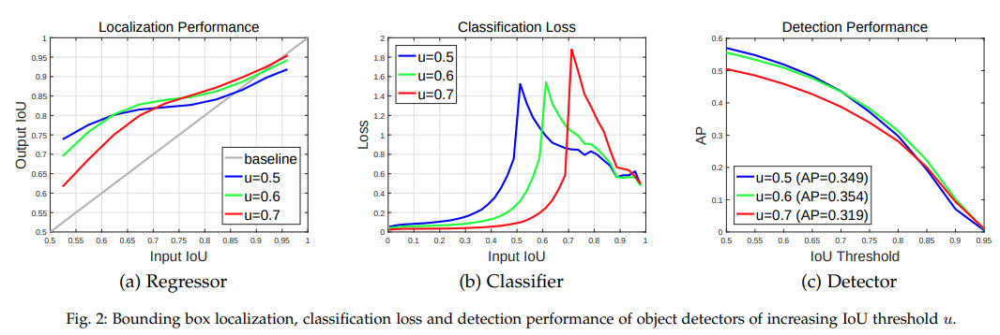
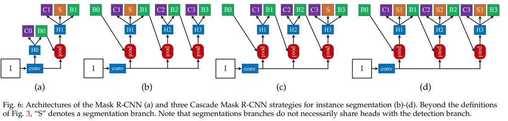
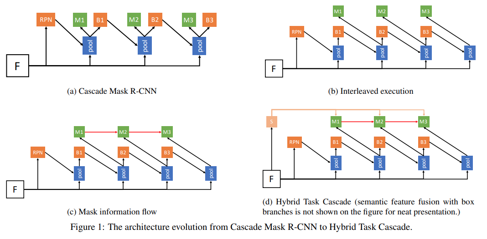

# HTC - CVPR 2019

---

```{admonition} Information
- **Title:** Hybrid Task Cascade for Instance Segmentation, CVPR 2019

- **Reference**
    - Paper: [https://arxiv.org/abs/1901.07518](https://arxiv.org/abs/1901.07518)
    - Code: [https://github.com/open-mmlab/mmdetection/tree/master/configs/htc](https://github.com/open-mmlab/mmdetection/tree/master/configs/htc)

- **Review By:** Hwigeon Oh

- **Last updated on July. 21, 2022**
```
## Related Works and Problem Statement

### 1. [Cascade R-CNN](https://arxiv.org/abs/1906.09756)


- R-CNN 계열의 모델을 학습 할 때 각 anchor에 Positive/Negative class를 assign 하는 과정이 필요하다.
- 이 과정에서 threshold $u$를 사용하는데, 이 값에 따라 모델의 성능이 달라진다.

:::{figure-md} fig-htc1


Relation between perfermance and Input IoU (source: arXiv:1906.09756)
:::


- `Input IoU`는 RPN의 output, `Output IoU`는 최종 prediction이다.
- 결과를 관찰해 봤을 때, 다음과 같은 insight를 얻을 수 있다:
    1. Input proposal이 정확할수록 Output도 정확하다.
    2. Input이 noisy한 경우에는 $u\approx\text{Input IOU}$ 인 경우가 그렇지 않은 경우보다 상대적인 성능이 높다.
    3. 각 $u$ 별로 성능 우위를 갖는 Input IoU들이 있다.
    4. {numref}`fig-htc1` .(c)를 보면 $u$가 높다고 성능이 높은 것은 아님을 알 수 있다.
    5. 최종 prediction이 RPN의 proposal보다 더 정확하다.

:::{figure-md} fig-htc2


Approach to improving performance (source: arXiv:1906.09756)
:::


- 따라서 Cascade R-CNN에서는:
    1. 다른 $u$를 가지고 학습한 여러 head를 이용
    2. RPN proposal보다 더 정확한 다른 head의 최종 prediction을 사용 하는 것으로 모델의 성능을 높히는 접근을 한다.

### 1. Cascade Mask R-CNN

- 단순한 Cascade R-CNN + Mask R-CNN

	:::{figure-md} fig-htc3
	

	Cascade Mask R-CNN (source: arXiv:1906.09756)
	:::

- bbox AP + 3.5%, mask AP + 1.2%
- HTC의 저자는 이 부분에 발전의 여지가 있음을 캐치했다:
    1. Cascade R-CNN이 object detection에서 성능을 올릴 수 있었던 이유는 이전 step에서의 더욱 정확해진 box proposal을 사용했기 때문이다. (Cascaed refinement)
    2. 하지만 Cascade Make R-CNN에서 mask head가 이전 head로부터 얻는 것은 더욱 정확한 box proposal 뿐이다.
    3. 따라서 mask head 끼리의 information flow/connection을 만들어 주면 segmentation 성능을 올릴 수 있을 것이다.

### Scene context

- 저자는 scene context가 중요한 힌트를 제공한다고 말한다.
    - 근거를 ablation study를 통해서 제공한다.
- scene context를 이용하기 위해서 별도의 semantic segmentation bracn를 사용한다.

## Proposed Method : Hybrid Task Cascade

### Overview

- 저자는 instance segmentation을 위한 Hybrid Task Cascade (HTC) 구조를 제안한다. 제안된 방법은 다음과 같은 구성을 가진다.
    
    (1) 기존 방법에서 적용한 Bounding box regression과 mask prediction를 병렬 구조가 아닌 교차로 배치하여 적용
    
    (2) 각 stage의 mask prediction를 direct path로 연결
    
    (3) Contextual information을 추가하기위해 semantic segmentation branch 추가
    
- Notations:
    - $\mathcal{P}$ : pooling operator (e.g. RoI Align)
    - $*B_{t}*$ : $t$*-*th stage box head
    - $*M_{t}$* : $t$-th stage mask head
    - $\textbf{r}_{t}$ : $t$-th stage box prediction
    - $\textbf{m}_{t}$ : $t$-th stage mask prediction

:::{figure-md} fig-htc4


The architecture evolution from Cascade Mask R-CNN to Hybrid Task Cascade (source: arXiv:1901.07518)
:::


### 1. Multi-task Cascade

(a) **Cascade Mask R-CNN**

- Mask R-CNN 구조를 개선하기 위해 가장 처음으로 시도해볼 수 있는 방법이 Cascade R-CNN와 결합하는 것이다.
- {numref}`fig-htc4`.(a)와 같이 Cascade R-CNN의 각 stage에 mask head를 추가한다. 이 과정을 수식으로 표현하면 다음과 같다.
    
    $$
    \begin{aligned}
    \textbf{x}_{t}^{box} &=
    \mathcal{P}(\textbf{x}, \textbf{r}_{t-1}), \textbf{r}_{t} = B_{t}(\textbf{x}_{t}^{box}) \\
    \textbf{x}_{t}^{mask} &= \mathcal{P}(\textbf{x}, \textbf{r}_{t-1}), \textbf{m}_{t} = M_{t}(\textbf{x}_{t}^{mask})
    \end{aligned}
    $$
    
    여기서 $\mathbf{x}$ 는 backbone network의 CNN features이며,  
    $\mathbf{x}_{t}^{box}$  와 $\mathbf{x}_{t}^{mask}$ 는 input RoI와 features $\mathbf{x}$ 로부터 유도되는 box와 mask feature를 나타낸다. 
    
- Box prediction과 mask prediction이 parallel하게 구성된 경우로 cascade 구조로 bounding box와 mask prediction에 동시에 향상을 기대할 수 있디만, bounding box refinement 성능 개선만 확인되었고, mask prediction의 개선은 크지 않았다.

(b) **Interleaved Execution**

- Cascade Mask R-CNN 구조에서 bounding box와 mask prediction branch는 서로 분리되어 학습되며 상호 작용이 없는 것을 알 수 있다.
- {numref}`fig-htc4`.(b)와 같이 현 시점의 bounding box prediction 결과를 이용하여 mask prediction의 feature를 추출하도록 직렬구조로 구성할 수 있다.

$$
\begin{aligned}
\textbf{x}_{t}^{box} &= \mathcal{P}(\textbf{x}, \textbf{r}_{t-1}), \textbf{r}_{t} = B_{t}(\textbf{x}_{t}^{box}) \\
\textbf{x}_{t}^{mask} &= \mathcal{P}(\textbf{x}, \textbf{r}_{t}), \textbf{m}_{t} = M_{t}(\textbf{x}_{t}^{mask})
\end{aligned}
$$

(c) **Mask Information Flow**

- {numref}`fig-htc4`.(c)와 같이 이전 step의 mask prediction도 이용해서 현재 step의 prediction을 만든다. (information flow)
    
    $$
    \begin{aligned}
    \textbf{x}_{t}^{box} &= \mathcal{P}(\textbf{x}, \textbf{r}_{t-1}) \textbf{r}_{t} = B_{t}(\textbf{x}_{t}^{box}) \\
    \textbf{x}_{t}^{mask} &= \mathcal{P}(\textbf{x}, \textbf{r}_{t}), \textbf{m}_{t} = M_{t}( \mathcal{F}(\textbf{x}_{t}^{mask}, \textbf{m}_{t-1}^{-}))
    \end{aligned}
    $$
    
    여기서 $\textbf{m}_{t-1}^{-}$은 prediction 직전의 feature이다. Figure x2의 붉은 선에 해당한다. 
    
- 구현 과정에서는 다음과 같이 간소화한 구조를 사용한다.

$$
\mathcal{F}(\textbf{x}_{t}^{mask}, \textbf{m}_{t-1}^{-}) = \textbf{x}_{t}^{mask} + \mathcal{G}_{t}(\textbf{m}_{t-1}^{-})
$$

:::{figure-md} fig-htc5


Architecture of multi-stage mask branches (source: arXiv:1901.07518)
:::


- Deconvolution layer전의 RoI feature를 다음 stage의 mask prediction feature로 활용하며, concatenate 하지 않고 element-wise sum을 사용힌다.
- 이전 stage의 box $\textbf{r}_{t-1}$와 현 stage의 box $\textbf{r}_{t}$의 크기가 달라도 feature에 대해 pooling 하기 때문에 3x3 conv에 padding을 주면 사이즈를 같게 유지할 수 있다.

$$
\begin{aligned} m_{\bar1}&=M_{\bar1}(x_t^{\text{mask}}), \\ m_{\bar2}&=M_{\bar1}(\mathcal{F}(x_t^{\text{mask}},\mathbf{m}_{\bar{1}})), \\ &\vdots \\ m_{\bar{t}-1}&=M_{\bar{t}}(\mathcal{F}(x_t^{\text{mask}},\mathbf{m}_{\bar{t}-2})) \end{aligned}
$$

- information path를 통해 backpropagation 과정에서 단절 없이 mask feature가 supervision을 획득할 수 있다.

### 2. Spatial Contexts from Segmentation

- Foreground와 background의 더 명확한 구별을 위해서 spatial context를 추가한다.
    
    $$
    \begin{aligned} 
    \textbf{x}_{t}^{box} &= \mathcal{P}(\textbf{x}, \textbf{r}_{t-1}) + \mathcal{P}(S(\mathbf{x}), \mathbf{r}_{t-1}) \\ 
    \textbf{r}_{t} &= B_{t}(\textbf{x}_{t}^{box}) \\ 
    \textbf{x}_{t}^{mask} &= \mathcal{P}(\textbf{x}, \textbf{r}_{t}) + \mathcal{P}(S(\mathbf{x}), \mathbf{r}_{t}) \\
    \textbf{m}_{t} &= M_{t}( \mathcal{F}(\textbf{x}_{t}^{mask}, \textbf{m}_{t-1}^{-}))
    \end{aligned} 
    $$
    
    여기서 $S$는 segmentation head를 의미한다.
    
- {numref}`fig-htc4`.(d)와 같이 Semantic segmentation을 수행하는 branch를 만들고, 해당 branch의 feature를 mask prediction에 활용한다.

:::{figure-md} fig-htc6


Semantic segmentation branch. (source: arXiv:1901.07518)
:::

### 3. Learning

- HTC의 모든 module은 미분가능하기 때문에 end-to-end로 학습이 가능하다.
- Loss function은 multi-task learning 형태로 구성된다.
    
    $$
    \begin{aligned} 
    &\displaystyle L = \sum_{t=1}^{T} \alpha_{t}(L_{bbox}^{t} + L_{mask}^{t}) + \beta L_{seg} \\ 
    &\displaystyle L_{bbox}^{t} (c_{i}, \textbf{r}_{t}, \hat{c}_{t}, \hat{\textbf{r}}_{t}) = L_{cls}(c_{t}, \hat{c}_{t}) + L_{reg}(\textbf{r}, \hat{\textbf{r}}_{t}) \\
    &L_{mask}^{t}(\textbf{m}_{t}, \hat{\textbf{m}}_{t}) = \text{BCE}(\textbf{m}_{t}, \hat{\textbf{m}}_{t}) \\
    &L_{seg} = \text{CE}(\textbf{s}, \hat{\mathbf{s}})
    \end{aligned} 
    $$
    
    - Bounding box prediction loss $L_{bbox}^{t}$ 는 Cascade R-CNN과 동일한 구조로 classification loss $L_{cls}$과 bounding box regression loss $L_{reg}$ 조합으로 구성된다.
    - Mask prediction loss  $L_{mask}^{t}$ 는 Mask R-CNN과 동일하게 binary cross entropy를 적용한다.
    - Semantic segmentation loss $L_{seg}$ 는 cross-entrophy를 적용한다.
    - 본 논문에서는 Cascade R-CNN의 hyperparameter와 동일하게 설정했고, 각 stage와 task의 balance를 조절하는 coefficient를 $\alpha=[1,0,5,0,25]$, $T=3$, $\beta=1$ 로 설정했다.

## Experiments Result

### 1. Implementation Details

- Train dataset
    - COCO 2017train (115k images)
    - Bounding box, mask prediction branch에는 instance annotation 적용
    - Semantic branch에는 COCO-stuff annotation 적용
- 3-stage cascade 구조로 구성
- Mask R-CNN과 Cascade R-CNN을 PyTorch로 다시 구현함.

### 2. Result

- COCO 2017 validation set과 test-dev set에서 COCO style AP를 비교한 결과 Cascade Mask R-CNN과 당시 SOTA인 PANet 대비 높은 box AP와 mask AP를 가짐을 확인.


```{image} pic/htc/htc7.png
:alt: htc7.png
:class: bg-primary mb-1
:align: center
```

- Cascade, Interleaved, Mask Information flow, Semantic feature fusion을 추가할 때마나 mask AP가 증가함을 확인할 수 있음.
  

```{image} pic/htc/htc8.png
:alt: htc8.png
:class: bg-primary mb-1
:align: center
```


```{image} pic/htc/htc9.png
:alt: htc9.png
:class: bg-primary mb-1
:align: center
```
