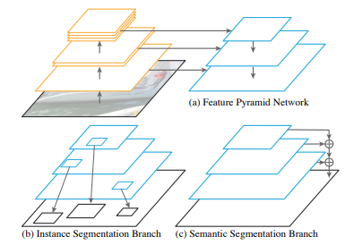

# PanopticFPN - CVPR 2019

---

```{admonition} Information
- **Title:** Panoptic Feature Pyramid Networks, CVPR 2019

- **Reference**
    - Paper: [https://arxiv.org/abs/1901.02446](https://arxiv.org/abs/1901.02446)
    - Code: [https://github.com/facebookresearch/detectron2](https://github.com/facebookresearch/detectron2)
    
- **Review By:** Taeyup Song 

- **Edited by:** Taeyup Song

- **Last updated on Fab. 6, 2022**
```

## Contribution

- Instance Segmentation을 위한 Mask R-CNN의 확장 버전으로 Feature Pyramid Networks (FPN)를 공용으로 활용하는 추가의 semantic segmentation brach를 이용 panoptic segmentation 이 가능함을 보임.
- “Things” class에 대한 Instance level의 mask의 성능은 유지하면서, “stuff” class에 대한 dense prediction도 통일된 network 구조로 수행함.

## Proposed Method

### 1. Model Architecture

- Panoptic segmenatation을 수행하기 위해 다음과 같은 사항이 고려되어야 함. 

    a. High-resolution: 미세한 구조(fine structure)를 포착하기 위해 적절하게 고해상도이어야 함.

    b. Rich: 정확한 class labels 추정을 위해 충분히 풍부한 semantics가 encode 되어야 함.

    c. Multi-scale feature: 다양한 크기의 stuff region을 예측하기 위해 multi-scale information을 capture 해야 함.
- FPN은 이미 3가지 조건을 만족하고 있음.

:::{figure-md} markdown-fig


Panoptic FPN architecture (source: arXiv:1901.02446)
:::

(1) Feature Pyramid Network (FPN)

- FPN은 다양한 resolution의 feature를 추출하기 위해 보편적으로 사용되는 network이며, ResNet과 같은 feature extractor에 top-down pathway를 추가하여 높은 해상도의 feature map의 semantic level을 높일 수 있도록 설계되어 있음.
- 보통 1/32에서 1/4 resolution을 가지는 feature를 추출하도록 구성됨.

(2) Instance segmentation branch

- FPN을 구성할 때, region-based object detector를 붙이기 쉽도록 모든 pyramid level에 동일한 channel 수(일반적으로 256 channel)가 되도록 구성함.
- Faster R-CNN의 경우 RoI pooling을 각 level의 feature에 적용하여 candidate에 대한 feature를 추출한 후 classfication과 bounding box refine을 수행함.

(3) Semantic segmentation branch

:::{figure-md} markdown-fig


Semantic segmentation branch (source: arXiv:1901.02446)
:::

- FPN의 각 level별 feature를 1/4 scale에 맞춰 upsample함. 각 upsample 과정에서 3x3 convolution과 group norm, ReLU를 적용한 후 2x bilinear upsampling을 수행. (각 feature의 scale에 따라 최종적으로 1/4 scale이 되도록 반복적으로 적용함)
- 최종적으로 upsampling된 features들을 element wise sum한 후 1x1 convolution, 4x bilinear upsampling한 후 softmax 를 적용하여 원본 크기의 pixel별 class labels을 추정함.
- stuff class에는 ‘other’ class를 추가하여 things에 해당하는 pixel을 assign함.

### 2. Inference and Training

(1) Panoptic Inference

- output의 각 pixel은 하나의 class label과(void 포함) instance id (stuff classes에서는 무시)를 가짐.
- Panopic FPN의 결과물은 instance /semantic brach의 결과가 중복될 수 있기 때문에 NMS와 유사한 후처리를 적용함.
a. 서로 다른 instance를 가지는 경우 confidence score를 기준으로 결정
b. instacen, semantic segmentation결과가 겹치는 경우 instance 값을 우선으로 함.
c. stuff region의 label 중 ‘other’ class는 area threshold를 적용하여 삭제.

(2) Joint training

- Instance segmentation branch는 $L_C$(classification), $L_B$(bounding-box loss), $L_m$(mask loss)를 의 총합으로 계산함. $L_C$, $L_B$는 sampled RoIs 수로 normalizae하고, $L_m$은 foreground RoIs수로 normalizae함.
- Semantic segmentation loss $L_s$는 per-pixel cross entropy loss로 계산함.
- 두 branch의 loss는 서로 다른 scale과 normallize 정책을 적용함.
    
    $$
    L=\lambda_i(L_C+L_b+L_m)+\lambda_sL_s
    $$
    

### 3. Analysis

:::{figure-md} pfpn-backbone


Backbone architechture (source: arXiv:1901.02446)
:::

- Semantic segmenation에는 dilated conv.와({numref}`pfpn-backbone`(b)), encoder-decoder({numref}`pfpn-backbone`(c))가 backbone으로 주로 사용됨. 

:::{figure-md} markdown-fig


Backbone architecture efficiency (source: arXiv:1901.02446)
:::

- Panoptic FPN의 경우 Mask-RCNN 구조를 활용하는 것이 목표였지만, dilated-8 network 대비 가볍고  encoder-decoder 구조 대비 2배 가벼운 구조를 가짐을 확인할 수 있음. 
- 특히 Dilation-16 network와 유사한 크기의 network로 4배 큰 output resolution을 얻을 수 있음.

## Experimental Result

### 1. **Traning details**

- COCO 2017 dataset
→ Instance segmentation: 80 thing classes, train/val/test/ = 118k/5k/20k 
→ Semantic segmentation: 92 stuff classes, train/val/test/ = 40k/5k/5k
→ Panoptic segmentation: 80 things / 53 stuff classes
- Mask R-CNN 1x training setting with scale jitter을 적용함.

### 2. **Discuss**

- Semantic segmentation을 단독으로 평가했을 때, COCO-stuff 2017 challenge에서  가장 높은 성능을 나타냄. cityscape DB에서는 SOTA인 DeepLab V3+와 유사한 성능과 efficiency를 보임을 알 수 있음.

```{image} pic/PanopticFPN/pfpn5.png
:alt: pfpn5.png
:align: center
```

- Panoptic segmentation을 기존 방법들과 비교했을 때, overall, stuff, thing 모두 높은 성능을 나타냄.

```{image} pic/PanopticFPN/pfpn6.png
:alt: pfpn6.png
:align: center
```

```{image} pic/PanopticFPN/pfpn7.png
:alt: pfpn7.png
:align: center
```

```{image} pic/PanopticFPN/pfpn8.png
:alt: pfpn8.png
:align: center
```

