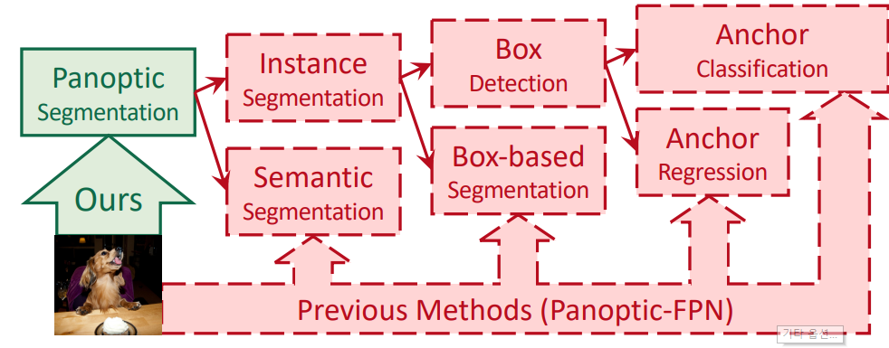
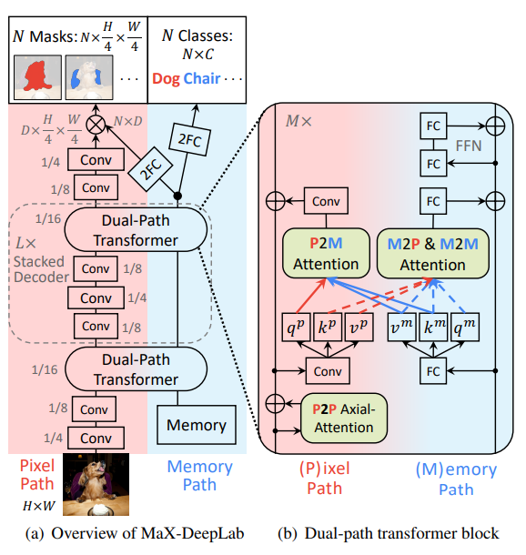
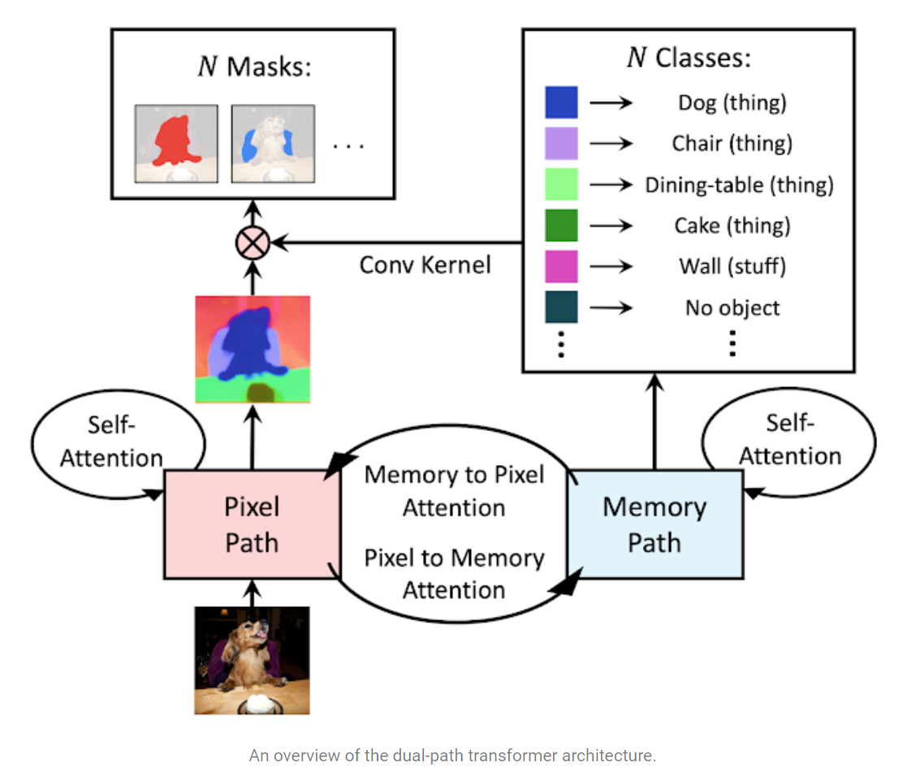

# [Draft] MaX-DeepLab - CVPR 21

---

```{admonition} Information
- **Title:** nd-to-End Panoptic Segmentation with Mask Transformers, CVPR 2021

- **Reference**
    - Paper: [https://arxiv.org/abs/2012.00759](https://arxiv.org/abs/2012.00759)
    - Code: [https://github.com/google-research/deeplab2](https://github.com/google-research/deeplab2)
    - review: [https://ai.googleblog.com/2021/04/max-deeplab-dual-path-transformers-for.html](https://ai.googleblog.com/2021/04/max-deeplab-dual-path-transformers-for.html),
    
- **Review By:** Jeunghyun Byun

- **Edited by:** Taeyup Song

- **Last updated on Fab. 7, 2022**
```

## Contribution

- 최초로 제안된 end-to-end panoptic segmentation 방법 
    - 기존의 방법들은 surrogate sub-task들 (e.g. box detection, anchor design rules, non-maximum suppression, 등등)을 포함한 pipeline을 사용함 (즉, hand-coded 된 prior에 의존)
    - MaX-DeepLab은 mask transformer을 사용하고 bipartite matching으로부터 inspire된 loss을 사용함
    - Dual-path transformer 사용
- COCO dataset에 대해서 새로운 SOTA 결과를 확인함.

## Background

:::{figure-md} prev-method


Overview of Previous Method (Source: arXiv:2012.00759)
:::

- 기존의 panoptic segmentation method는 {numref}`prev-method`의 붉은색으로 표현된 내용과 같이 surrogate sub-task들에 의존하여 panoptic segmentation mask 결과를 구함.
- 즉 기존의 panoptic segmentation은 한번에 결과값을 구하는 것이 아니라 여러 task들로 구성되어 있는 다소 복잡한 pipeline 으로 구성되어 있다. (e.g. anchors, box assignment rules, non-maximum suppression, thing-stuff merging)
    
- 복잡한 pipeline으로 구성되어 각각의 surrogate task에서 "undesired artifact"가 발생할 수 있고 pipeline을 거치면서 더 큰 artifact / noise 로 번질 수 있기 때문에 최근에는 pipeline을 간소화 하는 방향으로  여러 연구들이 소개되고 있다.

### (1) Box Based Method in Panoptic Segmentation

- Box based method는 Mask R-CNN과 같은 object detection 모델로 먼저 object bounding boxes들을 구하고 각 box안의 object에 해당되는 mask을 구한다. Instance segmentation과 Semantic segmentation가 서로 merge돼서 최종적인 panoptic segmentation을 구하게 된다.

- 대표적인 model은 다음과 같다. 
    - Panoptic FPN: 대표적인 모델
    - UPSNet: parameter-free panoptic head
    - DETR: end-to-end approach for box detection (to replace detectors in panoptic segmentation)
        - 여전히 detection bounding box결과에 많의 의존하는 한계를 가지고 있음.
    - DetectoRS: SOTA work in Box Based methods. Uses recursive feature pyramid and switachable atrous convolution.

### (2) Box Free Method in Panoptic Segmentation

- Box free method의 경우 먼저 semantic segment들을 구하고, 각각의 semantic segment에 속해 있는 pixel들을 group하여 instance segment들을 구한다.
- Grouping 방법은 Instance Center Regression, Watershed transform, Hough-voting 그리고 Pixel affinity를 적용할 수 있다. 

 - 대표적인 model은 다음과 같다. 
    - Axial-DeepLab: predict pixel-wise offsets to pre-defined instance centers **(Panoptic-DeepLab + Fully axial-attention)**
        - **한계: challenges with highly deformable objects (which have a large variety of shapes) or nearby objects with close centers in the image**
    - 비슷한 맥락의 논문으로: Deeperlab Single-shot image parser, Leveraging Semi-Supervised Learning in Video Sequneces for Urban Scene Segmentation (ECCV 2020), Semantic image-segmentation with deep convolutional nets and fully connected crfs (ICLR 2015) 등등이 있다.

- Box based method. Box free method들 모두 일종의 "hand-coded prior"을 사용하므로 end-to-end pipeline이 아니다.

## Proposed Method

### Notations:

Class-labeled masks:

$$\{\hat{y}\}_{i=0}^N=\{\left(\hat{m}_i,\hat{p}_i(c)\right)\}_{i=0}^N$$

$\hat{m}_i$ = predicted masks

$\hat{p}_i$ = predicted probability of assigning class c to mask hat(m)_i

### 1. PQ-style loss

$$\text{PQ}=\text{RQ}\times\text{SQ}$$

PQ = panoptic quality, RQ = recognition quality, SQ = segmentation quality

$$\text{sim}\left(y_i,\hat{y}_j\right)=\hat{p}_j(c_j)\times\text{Dice}(m_i,\hat{m}_i)\approx\text{RQ}\times\text{SQ}$$

(Dice coefficient definition)

### 2. Mask Matching

To assign a predicted mask to each ground truth, solve a one-to-one bipartite matching problem between the prediction set and the ground truth set. Use **Hungarian algorithm**.

$$\hat{\sigma}=\arg\max_{\sigma\in \mathfrak{S}_n}\sum_{i=1}^{K}\text{sim}(y_i,\hat{y}_{\sigma(i)})$$

- K matches predictions = positive masks
- (N-K) masks left = negative masks (i.e. no object)

### 3. Loss

For positive masks, we need to maximize (substitue mask matching equation's similarity with equation in PQ-style loss)

$$\max_{\theta}\mathcal{O}_{\text{PQ}}^{\text{pos}}=\sum_{i=1}^{K}\hat{p}_{\hat{\sigma}(i)}(c_i)\times\text{Dice}(m_i,\hat{m}_{\hat{\sigma}(i)})\approx\text{RQ}\times\text{SQ}$$

In practice, apply product rule of gradient and change probability into log p (since log p aligns with the common cross-entropy loss that scales gradients better for optimization):

$$\begin{aligned}\mathcal{L}_{\text{PQ}}^{\text{pos}}&=\sum_{i=1}^{K}\hat{p}_{\hat{\sigma}(i)}(c_i)\cdot\left[-\text{Dice}(m_i,\hat{m}_{\hat{\sigma}(i)})\right] \\&+\sum_{i=1}^{K}\text{Dice}(m_i,\hat{m}_{\hat{\sigma}(i)})\cdot\left[-\log \hat{p}_{\hat{\sigma}(i)}(c_i)\right] \end{aligned}$$

Loss for negative masks Total Loss:

$$\mathcal{L}_{\text{PQ}}^{\text{neg}}=\sum_{i=K+1}^{N}\left[-\log \hat{p}_{\hat{\sigma}(i)}(\oslash)\right]$$

```{image} pic/max-deeplab/maxdeeplab9.png
:alt: maxdeeplab9.png
:class: bg-primary mb-1
:width: 400px
:align: center
```

Total Loss: 

$$\mathcal{L}_{\text{PQ}}=\alpha\mathcal{L}_{\text{PQ}}^{\text{pos}}+(1-\alpha)\mathcal{L}_{\text{PQ}}^{\text{neg}}$$

### 4. Model Architecture

:::{figure-md} markdown-fig


Overview of MaX-DeepLab (Source: arXiv:2012.00759)
:::

**components:** dual-path transformer, stacked decoder, output heads (for mask and classes prediction)

:::{figure-md} markdown-fig


An overview of the dual-path transformer architecture (Source: arXiv:2012.00759)
:::

**Dual-path**: Augment a **2D pixel-based CNN (H x W x d_in)** with a **1D global memory (N x d_in)** of size N (i.e. total number of predictions)

Types of communications:

- traditional memory-to-pixel (M2P) attention
- memory-to-memory (M2M) self-attention
- pixel-to-memory (P2M) feedback attention
- pixel-to-pixel (P2P) self-attention (axial attention blocks)

Feedback attention's output **(Pixel-to-memory)** at pixel position a:

$$y_a^{p}=\sum_{n=1}^{N}\text{softmax}_n(q_a^p\cdot k_n^m)v_n^m$$

Output of **memory-to-pixel (M2P)** and **memory-to-memory (M2M)** attention:

$$q_b^m=\sum_{n=1}^{\hat{H}\hat{W}+N}\text{softmax}_n(q_a^p\cdot k_n^m)v_n^m,\\ k^{\text{pm}}=\left[\begin{matrix}k ^p \\k^m \end{matrix}\right], v^{\text{pm}}=\left[\begin{matrix}v^p  \\v^m \end{matrix}\right]$$

**Stacked Decoder:** stack L times traversing through (4, 8 and 16 output strides)

- Note: different to feature pyramid networks, the stacked decoder in this model does not directly use intermediate pyramidal features for prediction!

**Output heads:**

- Memory Path:
    - predict mask classes with 2 FC and softmax (N x C) → **p(c)**
    - another 2FCs predict mask features → **feature f** (N x D)
- Pixel Path:
    - employ 2 Convs to produce normalized → **feature g** ( D x H/4 x W/4)

Then, mask prediction m:

$$\hat{m}=\text{softmax}_N(f\cdot g)\in \mathbb{R}^{N\times\frac{H}{4}\times\frac{W}{4}}$$

Mask prediction inspired by CondInst and SOLOv2

### 5. Auxiliary Losses

- Instance discrimination: helps cluster decoder features into instances
- Mask-ID Cross-Entropy: classifies each pixel in N masks
- Semantic Segmentation

## Experimentation Result

Computing resources:

- 32 TPU cores for 100k iterations (54 epochs)

Data: COCO

Models: 

- **Max-DeepLab-L** (Wide-ResNet-41, L=2 stacking)
- **Max-DeepLab-S** (ResNet-50 with axial attention blocks, no stacking L=0)

```{image} pic/max-deeplab/maxdeeplab16.png
:alt: maxdeeplab16.png
:class: bg-primary mb-1
:width: 500px
:align: center
```

```{image} pic/max-deeplab/maxdeeplab17.png
:alt: maxdeeplab17.png
:class: bg-primary mb-1
:width: 500px
:align: center
```
    
```{image} pic/max-deeplab/maxdeeplab18.png
:alt: maxdeeplab18.png
:class: bg-primary mb-1
:width: 500px
:align: center
```
