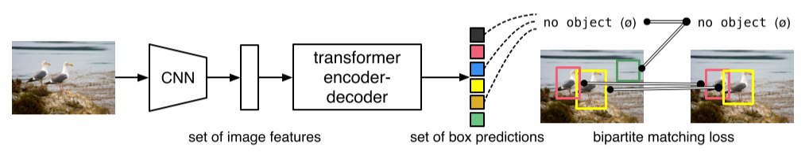
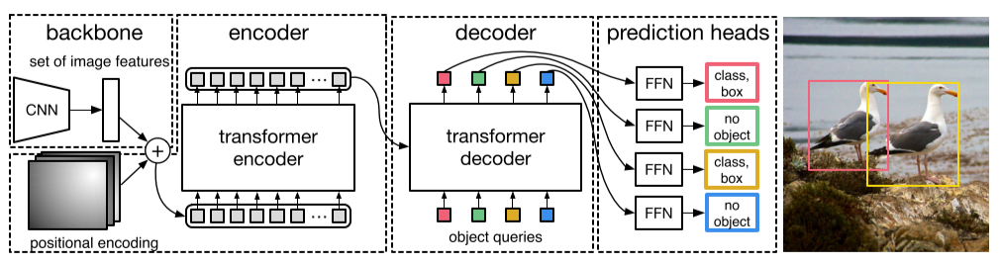
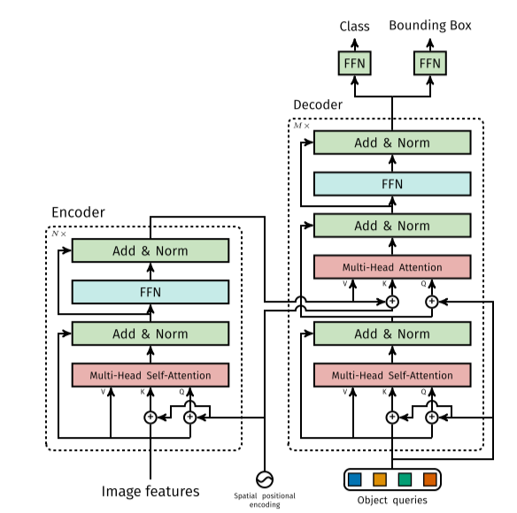
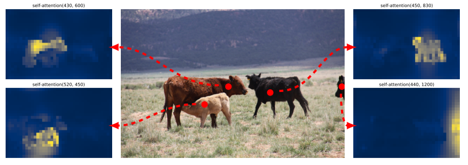
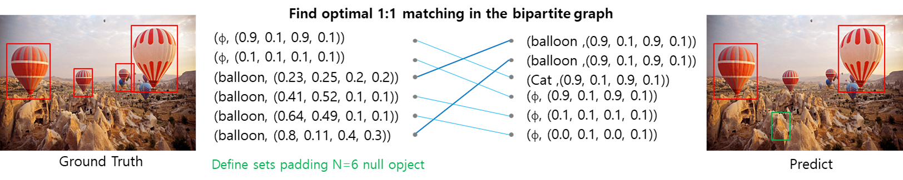
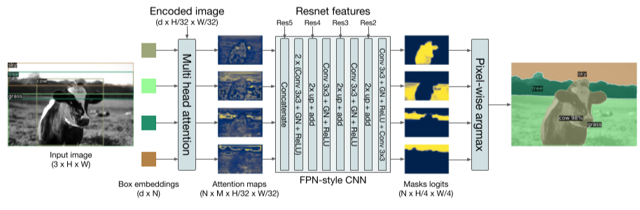

# DETR - ECCV 2020

---

```{admonition} Information
- **Title:** End-to-End Object Detection with Transformers, ECCV 2020

- **Reference**
    - Paper: [https://arxiv.org/abs/2005.12872](https://arxiv.org/abs/2005.12872)
    - Code: [https://github.com/facebookresearch/detr](https://github.com/facebookresearch/detr)
    
- **Review By:** Taeyup Song 

- **Edited by:** Taeyup Song

- **Last updated on Jan. 30, 2022**
```

## Problem Statement

- Object detection task는 bounding box와 label을 예측하는 것인데, 최근의 연구 결과들은 anchor를 기반으로 bbox regression/classification을 수행하는 휴리스틱한 방법을 주로 사용한다. 
- 결국 Target object의 bounding box의 aspect ratio와 같은 prior knowledge에 의존하고, 중복 검출을 제거하기 위해 NMS에 많은 의존을 하게 되어 occlusion이 발생한 object를 검출하기 어렵다. 에 되는 문제가 있음.
- RNN을 적용한 detector들은 auto-regressive(자기추론) sequence model을 이용하기 때문에 loss function은 변하지않는 순열의 prediction한다. 다만 최신 기준으로 평가된 적이 없으며, 병렬처리가 어려운 단점이 있다.

## Contribution

- Transformer를 이용한 end-to-end detection framework를 제안함.
- Unique prediction을  갖는 detector로 기존 detector가 가지는 휴리스틱한 로직 없이 Faster R-CNN과 동등한 성능을 가짐.
- Transformer로 간단하게 architecture 만들어져서 쉽게 확장 가능함. 

    → Panoptic Segmentation Task ..

    → ViT, Deformable DETR, Swin transformer

:::{figure-md} markdown-fig


DETR directly predicts (in parallel) the final set of detections by combining a common CNN with a transformer architecture (source: arXiv:2005.12872)
:::

## Proposed Method

### 1. Overall Architecture

:::{figure-md} markdown-fig


DETR uses a conventional CNN backbone to learn a 2D representation of an input image. (source: arXiv:2005.12872)
:::

- CNN backbone (ResNet)을 이용하여 feature를 추출한 후, transformer의 encoder-decoder를 통해 얻은 attention을 FFN(feed forward network)를 통해 고정된 수의 detection box와 label을 얻음
- FFN은 perceptron으로 이루어진 neural network이며 ReLU activation을 적용한 3 layer network로 구성된다.

### 2. Transformer

- CNN을 이용하여 추출한 feature map에서 bounding box와 이에 따른 class 정보를 예측하기 위해 Transformer architecture를 이용한다. Transformer는 적은 inductive bias를 가지는 구조로 global context를 이해하는데 좋은 성능을 발휘한다고 알려져 있다.
- Transformer의 encoder에서는 입력된 feature에 대한 self-attention을 이용하여 objects의 instance level의 정보를 추출한다.
- Transformer의 decoder는 N개의 objects에 대한 queries를 input으로 받으며, 각 object의 localiztion information을 예측한다. 이 과정에서 parallel decoding을 이용하여 연산을 가속할 수 있다.

:::{figure-md} markdown-fig


Architecture of DETR’s Transformer. (source: arXiv:2005.12872)
:::

- Encoder의 output은 각 개별 object instance 정보를 포함하고 있다. 그림 {numref}`detr-encoder`와 같이 붉은 점에 해당하는 self-attention을 보면 각 위치가 포함되는 개별객체에 attention되어 있음을 확인할 수 있다.

:::{figure-md} detr-encoder


Encoder self-attention for a set of reference points. The encoder is able to seperate indifidual instancese. (source: arXiv:2005.12872)
:::

- {numref}`detr-decoder`와 같이 DETR는 중첩된 object도 잘 구분할 수 있다.
- 각 instance의 외각점 (다리, 귀, 코 등)에서 높은 attention을 가진다.

:::{figure-md} detr-decoder


 Visualizing decoder attention for every predicted object (image from COCO val set). Predictions are made with DTRE-DC5 model. Attention scores are coded with differentn colors for different objects. Decoder typically  attends to object extremities, such as legs and heads. Best viweed in color (source: arXiv:2005.12872)
:::

### 3. Bipartite Matching

:::{figure-md} markdown-fig


Examples of bipartite matching (source: arXiv:2005.12872)
:::

- Matching cost $\mathcal{L}_{\text{match}}$을 최소화하는 최적의 permutation of $N$ element $\sigma\in \mathfrak{S}_N$을 찾아 1:1 matching을 수행한다. 이 과정은 Hungarian algorithm을 이용하여 효율적으로 계산할 수 있다.


$$
\hat{\sigma}=\arg\min_{\sigma\in\mathfrak{S}_N} \sum_i^N \mathcal{L}_{\text{match}}(y_i,\hat{y}_{\sigma(i)}),
$$

- Ground truth $y$는 $N$개의 prediction set구성되어 있다. 만약 실제 영상 내 object가 $N$보다 작은 경우 $N$개의 set이 되도록 ∅(no object)가 추가된다. 클래스 label $c_i$와 bbox의 center coordinates $b_i\in[0,1]^4$를 가지는 object $y_i=(c_i,b_i)$와 prediction $\hat{y}$에 대해 matching loss $\mathcal{L}_{\text{match}}$는 다음과 같이 구성된다.
    
    $$
    \mathcal{L}_{\text{match}}(y_i, \hat{y}_{\sigma(i)}) = -\mathbb{1}_{\{c_i \neq \mathbb{\emptyset}\}}\hat{p}_{\sigma(i)}(c_i)+\mathbb{1}_{\{c_i \neq \mathbb{\emptyset}\}}\mathcal{L}_{\text{box}}(b_i, \hat{b}_{\sigma(i)})
    $$
    
    여기서 $\sigma$는 permutation of N elements이며, $\hat{p}_{\sigma(i)}(c_i)$는 class $c_i$에 속할 확률이다. 
    
    
### 4. Loss Function

- DETR 학습을 위해 다음과 같이 Hungarian loss를 계산한다.
    
    $$
    \mathcal{L}_{\text{Hungarian}}(y,\hat{y})=\sum_{i=1}^{N} 
    [
    -\log \hat{p}_{\hat{\sigma}(i)}(c_i)+\mathbb{1}_{\{c_i \neq \mathbb{\emptyset}\}} \mathcal{L}_{\text{box}}(b_i,\hat{b}_{\hat{\sigma}}(i))
    ]
    $$
    
    여기서 $\hat{\sigma}$는 bipartite matching 과정을 통해 얻은 optimal assignment 이다.
    
- DETR는 anchor를 적용하지 않고 bounding box를 바로 prediction하기 때문에 오차가 커질 수 있고, 기존 detector가 bbox regression에 사용하는 L1 loss는 bbox가 클수록 오차가 커지는 문제점이 있다. 이러한 문제점을 보완하고자 L1 loss와 generalized IOU $\mathcal{L}_{\text{iou}}$를 이용하여 box prediction loss를 정의한다.

$$
\mathcal{L}_{\text{box}}(b_i,\hat{b}_{\sigma(i)})=\lambda_{\text{iou}}\mathcal{L}_{\text{iou}}(b_i,\hat{b}_{\sigma(i)})+\lambda_{L1}||b_i-\hat{b}_{\sigma(i)}||_1
$$


### 5. Panoptic Segmentation

:::{figure-md} markdown-fig


Illustration of the panoptic head. A binary mask is generated in parallel for each detected object, then the masks are merged using pixel-wise argmax. (source: arXiv:2005.12872)
:::

- DETR의 Transformer decoder output에 mask head를 추가하여 Panoptic Segmentation을 수행 가능하다.
- Detection task와 같이 DETR를 이용하여 stuff, things class를 각각 학습하고, 각 prediction boxes에 대해 binary mask를 prediction한다. 
- Transformer decoder에서 stuff, thing에 대한 detection 결과가 도출되면, 이를 저장해둔 Transformer의 encoder output을 이용하여 attention을 계산한다. (그림 x의 multi-head attention block)
- 각 prediction box에 대해 구한 M개의 attention heatmap을 FPN과 유사한 CNN architecture를 이용하여 해상도가 개선된 masks logits을 도출한다. (최종적으로 prediction된 mask는 stride 4의 크기를 갖도록 설정됨.)
- 최종적으로 구한 Mask logits에 대해 pixel-wise argmax를 적용하여 최종 panotic segmentation 결과를 도출한다.
- Mask head는 DETR와 함께 학습되거나, 분리되어 학습할 수 있다. 실험 결과 유사한 성능을 나타낸다고 한다. 각 mask는 독립적을 DICE/F-1 loss와 Focal loss를 적용하여 학습한다.


## Experimental Result

### 1. Object Detection

1. **Traning details
-** COCO 2017 detection dataset training 118k, vaildation 5k
- Learning rate of transformer 1e-4
- Learning rate of backbone: 1e-5
- Weight decay: 1e-4
- V100 x 16, 3 days for 300 epoch (batch size = 64) in case of basemodel
- DC5: dilated C5 stage, adding a dilation to the last stace of the backbone to increase the feature resolution

2. **Discuss**
- DETR DC5-R101의 $\text{AP}_{\text{S}}$와 같이 작은 object에 대해 성능이 저하됨을 확인할 수 있음

```{image} pic/detr/detr8.png
:alt: detr8.png
:class: bg-primary mb-1
:align: center
```

### 2. Panoptic Segmentation

1. **Traning details
-** COCO 2017 panotic dataset training (80categories에 53 stuff categories추가)
- 25 epoch in case of mask head

2. **Discuss**
- Baseline인 PanopticFPN과 비교하여 높은 성능을 나타내며, 특히 stuff class에 대한 결과인 $\text{PQ}^{\text{th}}$에서 baseline 대비 좋은 성능을 보임 
- Encoder의 attention을 이용하여 global reasoning을 효과적이며, segmentation task에도 DETR 구조가 효용이 있음을 나타냄.

```{image} pic/detr/detr9.png
:alt: detr9.png
:class: bg-primary mb-1
:align: center
```

```{image} pic/detr/detr10.png
:alt: detr10.png
:class: bg-primary mb-1
:align: center
```
