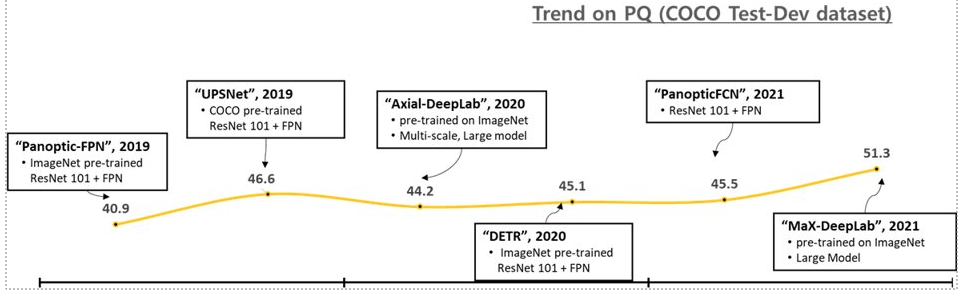

# Overview

## Introduction

## Performance Measure

$$
\text{PQ}=\frac{\sum_{(p,q) \in \text{TP}}\text{IoU}(p,q)}{|\text{TP}|+\frac{1}{2}|\text{FP}|+\frac{1}{2}|\text{FN}|}=\frac{\sum_{(p,q) \in \text{TP}}\text{IoU}(p,q)}{|\text{TP}|}\times\frac{\text{TP}}{{|\text{TP}|+\frac{1}{2}|\text{FP}|+\frac{1}{2}|\text{FN}|}}
$$

## Trend

:::{figure-md} performance-pano

Evolution of Panoptic Segmentation
:::

*Latest update: Jan 6, 2022*