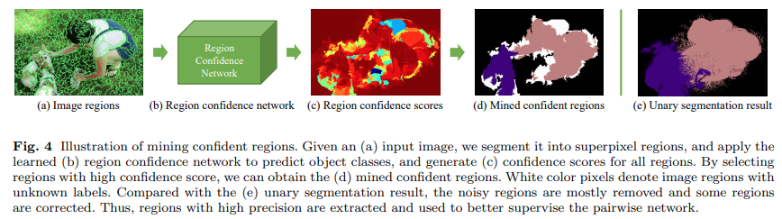

# IAL - IJCV 2020

---

- **Title:** Weakly-Supervised Semantic Segmentation by Iterative Affinity Learning

- **Review By:** Taeyup Song 

- **Edited by:** Taeyup Song 

---

## Reference

- Paper: [https://arxiv.org/abs/2002.08098](https://arxiv.org/abs/2002.08098)
(International Journal of Computer Vision (IJCV), 2020)
- Code: [https://github.com/WangXiang10/IAL](https://github.com/WangXiang10/IAL) (empty repo..)

## Contribution

- 각 pixel의 Label probability를 학습하기 위한 Unary segmentation network와 이를 refine하기 위한 pairwise affinity network로 구성된 architecture 제안
- 정확한 annotation 없이 신뢰성 높은 pixel affinity를 학습하기 위한 mining confident regions 기법과, 제안한 framework과 equivalent한 energy function을 local min.에 수렴시키기 위해 iteratively하게 학습을 수행하는 방법을 제안.
- PASCAL VOC 2021 및 COCO dataset에서 좋은 성능을 나타냄을 확인.

## Proposed Method

### 1. Architecture

- 각 pixel $x$의 label probability를 구하기 위한 Unary network $F=f(x,W_f)$과 pixel affinity를 학습하기 위한 pairwise network $G=f(x,W_g), G \in \mathcal{R}^{N \times N}$ 로 구성됨.

:::{figure-md} markdown-fig


Illustration of the proposed framework
:::

- Unary network를 이용하여 추출한 probability map $\alpha_t^u$을 confident region mining을 거친 후 pairwise network의 supervision으로 사용함.
- Pairwise Network를 이용하여 구한 affinity transformation matrix $G$를 이용하여 coarse label probabilities map $\alpha_t^u$를 refine 하여 $\alpha_t^p=G_t\alpha_t^u$를 구한 후 다음 step의 Unary network의 supervision으로 사용.

### 2. Formulation

- 각 영상을 un-directed weighted graph $\mathcal{G}=(V,E)$로 표현함.
→ Vertex set $V=\{v_1,...,v_N\}$에서 vertex $v_i$와 $v_j$간의 edge는 weight $w_{ij}$를 갖는다
→ 모든 weight는 adjacency matrix $W=(w_{ij})_{i,j=1,...,N}$로 표현 가능하다. 
→ Degree matrix $D$는 degrees $d_1,...d_N$를 element로 갖는 diagonal matrix이다. 
→ Degree는 $d_i=\sum_{j=1}^{N}w_{ij}$으로 표현된다.
- Semantic segmentation을 위해 다음과 같은 energy loss function을 minimize 한다.
(유사도가 높은 픽셀이 유사한 label을 같도록 학습함.)
    
    $$\alpha^*=\arg\max_{\alpha}J(\alpha, W_f, W_g)=\arg\min_{\alpha}\alpha^{T}L\alpha$$
    
    여기서 $\alpha$는 output label의 hidden state, $L=D-W$는 Laplacian matrix이며 $\alpha^TL\alpha$는 다음과 같이 나타낼 수 있다. 
    
    $$\begin{aligned}
    \alpha^TL\alpha&=\alpha^T(D-W)\alpha \\ 
    &=\sum_{i=1}^{N}d_i\alpha_i^2 - \sum_{i,j=1}^{N}\alpha_i\alpha_jw_{i,j} \\ 
    &=\frac{1}{2}\left( \sum_{i=1}^{N}d_i\alpha_i^2-2\sum_{i,j=1}^{N}\alpha_i\alpha_j w_{i,j}+\sum_{j=1}^{N}d_j\alpha_j^2\right) \\
    &=\frac{1}{2}\sum_{i,j=1}^{N}w_{i,j}(\alpha_i,\alpha_j)^2
    \end{aligned}$$
    
- 본 논문에서는 $\alpha$를 추정하기 위해 similarity metric을 설계하고 최적화하는 방법을 사용하지 않고, **EM formulation 기반으로하는 iterative learning method를 적용하여  probability map과 network를 refine하는 방법을 제안함.**
- $G=I-D+W=I-L$가 Pairwise network $g$와 pairwise/unary network의 output $\alpha_p$와 $\alpha_u$를 이용하여 학습가능한 Affinity transformation matrix를 나타낸다면, EM procedure는 다음과 같이 나타낼 수 있다.
    
    (1) Initialization: 
    
    Class Activation Map에서 얻은 object seed $Y_0$를 이용하여 초기 parameter $\{W_f,W_g\}_0$과 unary response map $\alpha_0^u$를 얻는다. 
    
    (2) E-Step
    
    $t$ iteration에서의 $J_t$ loss를 최소화하여 unary probability를 refine 하고, 
    
    $$\frac{\partial J}{\partial \alpha_t^u}=L_t\alpha_t^u=(1-G_t)\alpha_t^u$$
    
    $t$-step에서의 pairwise network의 output $\alpha_{t}^{p}$를 refine 한다. 
    
    $$\alpha_{t}^{p}=\alpha_{t}^{u}-\Delta\alpha_{t}^{u}$$
    
    unary probability map을 이용하여 pairwise network의 output을 refine한다.
    
    $$\alpha_{t}^{p}=G_t\alpha_{t}^{u}$$
    
    (3) M-Step
    
    $J_t$가 최소화 되도록 Network $f_{t+1}(x,W_f)$와 $g_{t+1}(x,W_g)$의 parameter $W_f$와 $W_g$를 학습한다. 이때 supervision은 $\alpha_{t}^{p}$로부터 추출한다. 
    

- Energy function $\mathbf{J}$가 $\alpha$와 network parameter에 모두 미분 가능하기 때문에 EM procedure가 local minimum에 항상 수렴하는 것을 보이는 것은 간단함.
    - For training pairwise network in the $t+1$ step, we consider the softmax cross-entropy loss function
        
        $$H(\alpha_{t+1}^u)=-{\alpha_{t+1}^u}^{\top}\log\alpha_{t+1}^{P}$$
        
        여기서 $\log$함수가 단조 증가 함수이고, pairwise network의 output이 $\alpha_{t+1}^p=G_{t+1}\alpha_{t+1}^u$이므로 
        
        $$\begin{aligned} \min H&=-\min{\alpha_{t+1}^u}^{\top}\alpha_{t+1}^{P} \\ &=-\min \alpha_{t+1}^u G_{t+1}\alpha_{t+1}^u =-\min {\alpha_{t+1}^u}^{\top}(I-L_{t+1})\alpha_{t+1}^u \end{aligned}$$
        
        to opt. $\alpha_{t+1}^P$is to min. the second term
        
    
    $$L_{t+1}=\arg\max_{L_{t+1}^*}{\alpha_{t+1}^u}^{\top}L_{t+1}\alpha_{t+1}^u$$
    
    - $\alpha_t^{p}$를 unary network와 $\alpha_{t+1}^{u}$을 학습하기 위한  supervision으로 사용하는 과정은 M-step으로 나타낼 수 있음.
    - 하지만 pairwise network가 iteration을 반복하며 affinity를 학습하는 과정중에 정확한 supervision이 제공되지 않기 때문에 항상 수렴한고 말할 수 없음.
    - 본 논문에서는 이런 문제를 해결하기 위해 mining된 confidence region  $Y_{t+1}$ 적용함. 이를 이용하면 energy function을 낮출 수 있을 것으로 예상함.
    
    $$Y_{t+1}^{\top}L_{t+1}\alpha_{t+1}^u\leq {\alpha_{t+1}^u}^{\top}L_{t+1}\alpha_{t+1}^u$$
    

### 2. Training

(1) Unary network

- AffinityNet과 유사한 형태로 구성. DeepLab 구조에 object seed로 CAM을 사용함.
- CAM으로부터 얻은 pseudo label을 이용하여 fully-supervised method와 같은 방법으로 softmax loss를 이용하여 학습함.
- Unary network를 이용하여 추출한 probability map $\alpha_t^u$을 confident region mining을 거친 후 pairwise network의 supervision으로 사용함.

(2) Pairwise network

- Spatial Propagation Network(SPN) 구조 적용하여 affinity transformation matrix $G$를 학습
- 정확한 label supervision이 주어지지 않는 상황이기 때문에 segmentation 결과가 정확하지 않아 학습이 잘 안될 수 있음
- 이 문제를 해결하기 위해 segmentation 결과로부터 confident region을 mining한 후 이를 이용하여 학습하는 과정을 거침.  pairwise affinity network를 학습하기 위해 softmax loss를 적용함.
    
    $$\mathcal{L}_{\alpha}=-Y_t^{\top}\log\alpha_t^p$$
    
    여기서 $Y_t$는 mining된 confidnet regions임.
    
- 잘 학습된 affinity matrix는 같은 object 내의 pixel들 처럼 같은 label을 가지는 영역에서는 smooth한 결과를 가지고, 명확한 경계를 가져야 함. 정확한 affinity matrix를 학습하기 위해, superpixel을 이용한 region smoothness loss를 제안함.
    
    $$\mathcal{L}_s=||G-G_s||_2^2$$
    
    여기서 $G$는 affinity matrix를, $G_s$는 각 super-pixel region을 나타냄. 
      
    
- $G$를 이용하여 coarse label probabilities map $\alpha_t^u$를 refine 하여 $\alpha_t^p=G_t\alpha_t^u$를 구한 후 다음 step의 Unary network의 supervision으로 사용.

(3) Mining Confident Region 

:::{figure-md} markdown-fig


Illustration of mining confident regions
:::

- 정확한 label annotation없이 신뢰할 수 있는 affinity matrix를 추출하기 위해 Confidence region을 mining함.
    
    (1) image에서 분할한 각 super-pixel region $S=\{S_{i,j}\}$로 분할함. 
    
    (2) 어떤 super-pixel의 80% 이상이 unary network의 output에서 class $c$에 matching 된다면 이 superpixel을 class $c$의 sample로 사용함 $\mathcal{D}=\{S,L\}_{i,j}$
    
    (3) 각 class의 sample을 region classification network $f_c^m$를 이용하여 confidence score를 구함.
    
    (4) segment label과 다른 classification 결과가 나오는 영역을 제거함.
    
- region classification network $f_c^m$는 mask pooling scheme을 포함하는 fast R-CNN구조를 적용하며, unary network의 label 정보를 supervision하는 cross-entropy loss을 이용하여 학습함.
    
    $$\mathcal{L}_m=-\sum_{i,j,c}L_{i,j}(c)\log f_c^m(S_{i,j}|\theta_m)$$
    
    여기서 $L_{i,j}$는 one-hot vector로 class c 에 해당하는 element만 1의 값을 가짐. 
    

## Experimental Result

### 1. Performance Evaluation

```{image} pic/ial/ial3.png
:alt: ial3.png
:class: bg-primary mb-1
:align: center
```

```{image} pic/ial/ial4.png
:alt: ial4.png
:class: bg-primary mb-1
:align: center
```

```{image} pic/ial/ial5.png
:alt: ial5.png
:class: bg-primary mb-1
:align: center
```

```{image} pic/ial/ial6.png
:alt: ial6.png
:class: bg-primary mb-1
:align: center
```
```{image} pic/ial/ial7.png
:alt: ial7.png
:class: bg-primary mb-1
:align: center
```


