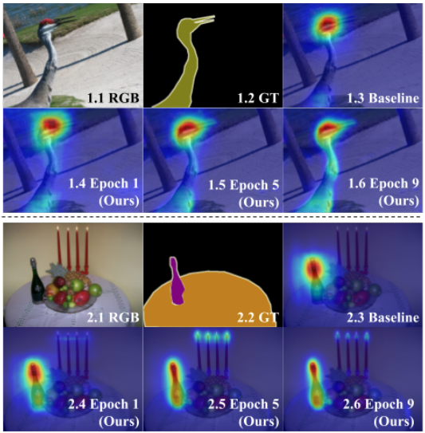
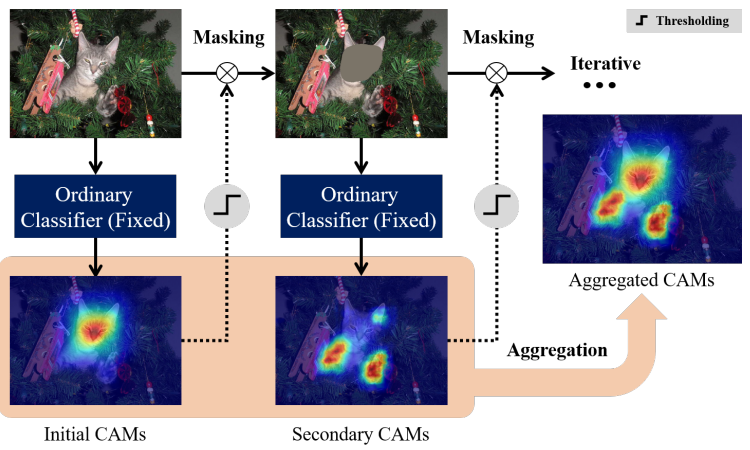
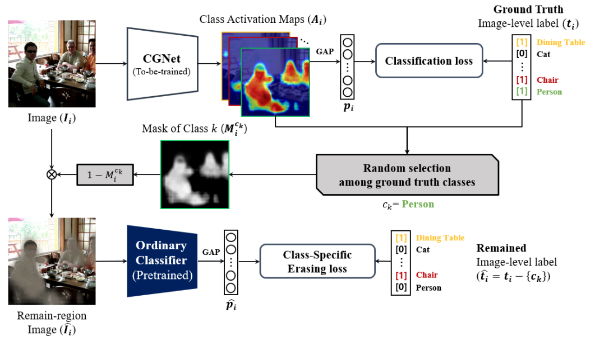
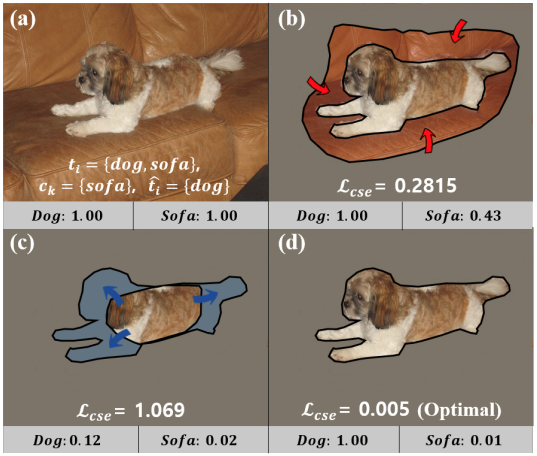
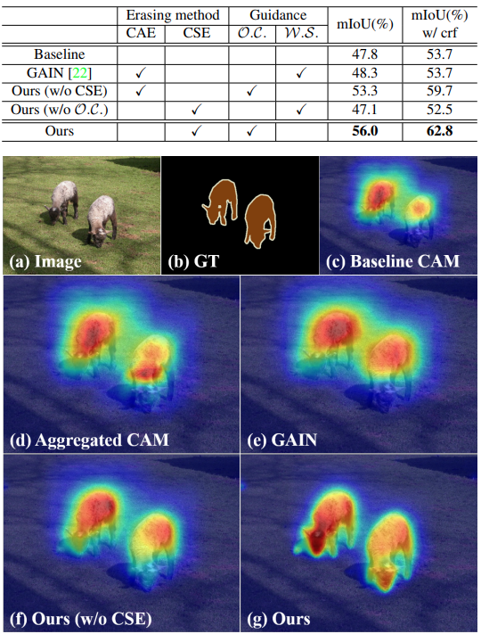

# GCNet - ICCV 2021

---

```{admonition} Information
- **Title:** CGNet: Unlocking the Potential of Ordinary Classifier: Class-specific Adversarial Erasing Framework

- **Reference**
    - Paper : [https://openaccess.thecvf.com/content/ICCV2021/papers/Kweon_Unlocking_the_Potential_of_Ordinary_Classifier_Class-Specific_Adversarial_Erasing_Framework_ICCV_2021_paper.pdf](https://openaccess.thecvf.com/content/ICCV2021/papers/Kweon_Unlocking_the_Potential_of_Ordinary_Classifier_Class-Specific_Adversarial_Erasing_Framework_ICCV_2021_paper.pdf)
    - Code : [https://github.com/KAIST-vilab/OC-CSE](https://github.com/KAIST-vilab/OC-CSE)
    
- **Review By:** 김소연

- **Edited by:** 

- **Last updated on July. 7, 2022**

```

## Problem statement

- Image-level label을 사용하는 WSSS는 CAM을 활용하여 pseudo label을 생성하는 방법을 주로 사용한다.
    - 특정 class를 classification하는데 가장 특징적인 영역(discriminative region)을 하이라이트하는 특성이 있다. (attention score가 높게 나타남.)
    - 
- CAM에서 attention되지 않는 object의 영역(덜 특징적인 부분)에 대한 attention을 높여 pseudo label의 정확도를 향상 시키기 위해 제안된 Adversarial erasing(AE) 기법은 CAM의 attention score가 높은 영역을 제거 (masking)후 iterative하게 CAM을 반복 생성하는 기법이다.
- 기존 AE 기법은 attention score가 높은 영역을 erasing (mask 적용) 후 classifier를 반복적으로 학습하는 과정을 거친다.
    - class 정보와 무관하게 (class-agnostic) erasing을 수행하여 class간의 경계에서 정보를 confusion이 발생한다.
    - 또한 iteration이 거듭될 수록 attention 영역이 확장되어 object 영역에 대한 정확한 attention을 얻기 어렵다. 이를 해결하기 위해 추가적인 saliency module을 추가[SeeNet])하는 등 다수의 network brench를 적용한 기법들이 제안되었으나, 학습 과정의 복잡도를 증가시키는 문제가 있다.

## Contribution

- Pre-trained classifier(ordinary classifier)를 이용한 class-specific AE architecture를 제안한다.
- Discriminative regions이 지워졌을 때 ordinary classifier가 덜 특징적인 영역을 activate할 수 있음을 실험으로 확인하고, ordinal classifier의 potential을 최대한 활용하도록 구성되어 있다.
    1. 한 개의 target class를 임의로 선택하여 erasing mask를 생성하고,
    2. Ordinary classifier의 class probability를 이용하여 mask가 target class의 영역을 잘 포함하는지 판단
- CAMs Generation Network (CGNet)은 CAM이 다른 class의 영역을 침범하지 않게 제약을 주면서 target class의 CAM을 생성함.
    - CGNet은 더 정확한 boundary의 CAM을 얻기 위해 erased target class의 score를 낮추고, 다른 남아있는 class에 대한 score는 높게 유지되도록 학습.
    - class-specific erasing 방식은 object boundaries에서의 CAM의 intrusion을 억제함으로써 이러한 confusion을 줄임.

:::{figure-md} gcnet-fig1


Qualitative comparison between the CAMs of baseline (ordinary classifier [2]) and ours on the PASCAL VOC 2012. (source: GCNet, ICCV 2021)
:::

- Image level label (classification label)과 CGNet으로 생성한 CAM과 pseudo label을 이용하여  DeepLab network를학습하여 PASCAL VOC 2012와 MS-COCO 데이터셋에 대해 WSSS SOTA 성능을 달성.

## Potential of Ordinary Classifier

- Ordinary classifier에서 도출된 CAM은 주로 가장 discriminative한 부분만을 하이라이트한다고 알려져 있지만, 실험을 통해 object 전체 영역을 activate 할 수 있음을 확인 할 수 있다.
- Recursive erase-and-inference 실험
    - Ordinary pre-trained classifier로 initial CAM을 얻는다.
    - 추가적인 학습 없이 이미지를 마스킹한 이미지에 대해 re-inference를 통해 얻은 CAM에서 object와 관련된 영역을 activate함을 확인했다. (무시되는게 아니라 상대적으로 덜 눈에 띄었던 것임)
    - CAM 문제가 sparsity와 incompleteness에 있는 것이 아니라 activation 간의 imbalance에 있다는 것을 알 수 있다.

:::{figure-md} gcnet-fig2


Diagram of a recursive erase-and-infer scheme. (source: GCNet, ICCV 2021)
:::
    

- Pre-trained model을 사용하는 경우 discriminative 영역을 더 학습할 기회가 없고, masking threshold를 정하기 어려워진다. 이런 문제를 해결하기 위해 본 논문에서는 adaptive/recursive 방식을 적용한 learned-based AE framework 제안한다.

## Proposed Method

### 1. CAMs Generation

- 일반적으로 CAM을 생성하기 위해 classification network의 마지막 layer를 GAP → fully-connected layer 순으로 구성하지만, ACoL[]과 같이 1x1 convolution layer (out channel = num_class)과 GAP로 변경한다.
- $c_k$ 클래스의 CAM은 다음과 같이 정의할 수 있다.
    
    $$
    A^{c_k}(x,y) = f^{cam}_{c_k}(x, y)
    $$
    
    여기서 $f^{cam}_{c_k}$는 classification network의 마지막 convolution layer의  $c_k$번째 channel의 feature map 이다.
    
- Class prediction $p$는 다음과 같이 정의 가능하다.
    
    $$
    p = \sigma (GAP(f^{cam}))
    $$
    
- CAM $A^{c_k}(x,y)$을 back-propagation 가능한 mask로 사용하기 위해, ReLU activation을 적용하고 max 값에 대해 normalization을 수행한다.

$$
A^{c_k} = \frac{ReLU(A^{c_k})}{max(ReLU(A^{c_k}))}
$$

- Bilinear upsampling으로 이미지와 같은 크기로 키워준다.

### 2. AE-based Framework with CSE (Class-Specific Erasing) method

:::{figure-md} gcnet-fig3


Overview of our AE-based framework with the proposed CSE method. (source: GCNet, ICCV 2021)
:::

- CGNet을 이용하여 입력 이미지 $I_i$에 대한 CAM $A_i$을 생성한다.
- 이미지 포함된 class 중 하나의 target class $c_k$를 랜덤 선택하고, 해당 class의 CAM을 이용하여 mask $M^{c_k}_i$을 생성, 입력 영상을 masking 한다.
- 마스킹된 이미지 $\hat I_i=(1-M_i^{c_k})$를 ordinal classifier를 이용하여 target class와 그 외의 class의 probability를 계산하고, class-specific erasing loss를 계산한다.
    - 마스킹된 이미지가 선택된 target class을 제외한 class의 영역만을 포함하도록 다음과 같은 loss를 이용하여 CGNet을 학습한다.
        
        $$
        L_{ours} = L_{cls} + \lambda L_{cse} = l_{bce}(p_i, t_i) + \lambda l_{bce}(\hat p_i, \hat t_i)
        $$
        
        여기서 $p_i$, $t_i$는 GCNet을 이용하여 얻은 prediction 및 ground truth이며, $\hat{p_i}$, $\hat{t_i}$는 ordinal classifier을 이용하여 얻은 prediction 및 ground truth이다. Loss $L_{cls}$, $L_{cse}$는 binay cross entrophy loss $l_{bce}$를 적용한다. 
        

### 3. Class-agnostic vs. Class-specific Erasing Method (CSE)

- Class-agnostic Method의 경우 CAM에 pixel-wise max function를 이용하여 mask를 생성함.
    - mask가 적용된 영상에 대해 ordinary classifier의 label 정보를 알 수 없으므로, loss function을 다음과 같이 표현할 수 있음.
        
        $$
        L_{agno} = L_{cls} + \lambda L_{cae} = l_{bce}(p_i, t_i) + \lambda l_{bce}(\hat p_i, empty\ label\ set)
        $$
        
    - 생성된 마스크에서 다른 클래스 객체와의 boundary가 부정확하더라도, 이를 보정할 수 없음.
- CSE에서는 $L_{cse}$가 있어서 CGNet이 ordinary classifier로부터 localization을 학습하여 boundary를 보전하며 CAM을 생성할 수 있다.
- Class-specific Erasing 과정


    :::{figure-md} gcnet-fig4
    

    The illustration showing how CSE method works. (source: GCNet, ICCV 2021)
    :::
    
    - {dog, sofa}가 포함되어 있는 입력 영상에서 target class $c_k$는 {sofa}, remaining class $\hat t_i$는 {dog}이라고 가정하면
        1. CAM이 모든 target 영역을 attention하고 있다면 {numref}`gcnet-fig4` (d)와 같이 ordinary classifier는 mask된 영상에 대해 target class는 낮은 class probability를 나타내고 그 외의 class probability는 1에 가까운 값을 가진다.    
        2. {numref}`gcnet-fig4` (b)와 같이 생성된 CAM이 target class의 영역을 모두 포함하지 않은 경우 ordinary classifier는 target class인 {sofa}의 probability가 높아진다. 이 경우 CSE Loss가 target인 {sofa}에 대한 activation map을 확장하기 위해 {sofa} class의 confidence score를 낮추는 방향으로 학습된다. 
        3. {numref}`gcnet-fig4` (c)와 같이 target인 {sofa} class의 activation map (회색 부분)이 over-activated 됐을 때, target 외의 class {dog}의 영역을 침범하고, dog의 confidence score가 낮아지게 된다. Remained image-level label이 dog class가 있어야 하기 때문에, $L_{cse}$가 intrusion이 있다는걸 알고 CGNet이 sofa의 activation map을 줄일 수 있도록 학습될 수 있다.
    - 기존의 AE 방법이 activation map을 조정할 수 없어서 재학습을 이용한 것과 다르게, class-specific erasing 방법을 사용해서 다른 클래스의 객체 간의 경계선 정보를 보전하는 방향으로 학습됨을 알 수 있다.

### 4. CAM Refinement

- Pseudo labels 생성을 위/해 CGNet에서 생성한 CAM을 CRF (Conditional Random Field)를 적용해서 refine한 후 background activation map을 계산하여 AffinityNet을 학습한다.

$$
A_{bg}(x,y)=\{1-\max_{c\in t}A(x,y)\}^{\alpha}
$$

- 생성된 Pseudo labels를 사용해서 Segmentation을 위한 Deeplab network를 학습한다.

## Experiments

### 1. Implementation Details

(1) Dataset: PASCAL VOC 2012 Benchmark, MS COCO

(2) Optimization

- 

(3) Data augmentation

- 모든 training image에 대해 Random resize, horizontal fip, color jittering, random crop 수행

(4) Backbone: ResNet38 (CGNet, ordinary classifier (pre-trained by VOC 2012))

### 2. Experimental Results

- Baseline (AffinityNet) 및 class-agnostic AE method에 비해 ordinary classifier ($\mathcal{O}.\mathcal{D}.)$와 class-specific Erasing method를 적용한 CGNet이 높은 성능을 나타냄을 확인.

:::{figure-md} gcnet-fig5


Qualitative comparison of CAMs among several methods on the PASCAL VOC 2012. (source: GCNet, ICCV 2021)
:::

- PASCAL VOC 2012에서 test한 결과 WSSS 방법 중 validation set에서 가장 좋은 성능을 나타냄을 확인. (test set의 경우  saliency 모듈을 적용한 Group-WSSS 다음으로 높은 성능을 보임)

```{image} pic/gcnet/gcnet7.png
:alt: gcnet7.png
:class: bg-primary mb-1
:align: center
```

```{image} pic/gcnet/gcnet6.png
:alt: gcnet6.png
:class: bg-primary mb-1
:align: center
```