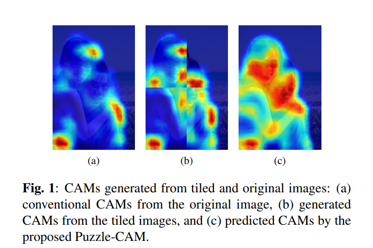
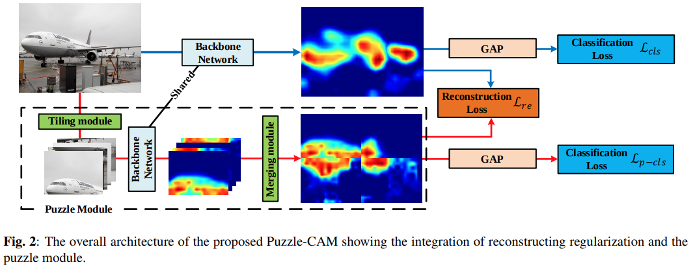

# PuzzleCAM - ICIP 2021

---

```{admonition} Information
- **Title:** Puzzle-CAM: Improved localization via matching partial and full features, ICIP 2021

- **Reference**
    - Paper : [https://arxiv.org/abs/2101.11253](https://arxiv.org/abs/2101.11253)
    - Code : [https://github.com/OFRIN/PuzzleCAM](https://github.com/OFRIN/PuzzleCAM)
    
- **Review By:** 김태규

- **Last updated on Aug. 13, 2022**

```

### INTRODUCTION

- 대부분의 WSSS가 segmentation network의 학습을 위해 CAM에 기반반 pseudo-labels을 생성하는 접근 방식을 사용한다.
- 이 과정에서 가장 큰 문제는 CAM이 class를 가장 잘 구분하기 위한 영역에만 activation된다는 점이다.
    - CAMs 는 객체의 작은 부분을 효과적으로 탐지 하지만 전체적으로 segmentation은 못한다.
    - {numref}`fig-puzzlecam1`에서 원본이미지의 CAM과 tile로 자른 이미지의 CAM이 다르게 표현된다.
    
:::{figure-md} fig-puzzlecam1


CAM generated from tiled and original images (source: 	arXiv:2101.11253)
:::
    

- 통합된 객체 영역을 검출을 위한 WSSS을 위해 **Attention-based feature learning** 기법을 사용한 Puzzle-CAM을 제안.
    - Self-supervision을 제공하기 위해 tiled image와 원본 image에서 생성된 CAM에 대해**Reconstructing regularization**을 적용함.
    - Network prediction consistency를 위해 image와 tiled image에서 생성되어 merge된 CAM을 분리하는 puzzle module을 제안함.  (without adding layers)
    - Puzzle-CAM은 원본이미지의 CAM과 병합된 CAM간의 차이를 줄이는 Reconstructing regularization loss가 존재하는 샴 네트워크 형태로 구성된다.

## Proposed Method

### 1. Motivation

- 단일 이미지의 CAM은 각 클래스의 가장 대표적인 영역을 탐지하므로, 동일한 클래스의 CAM을 생성할 때 모델은 객체의 일부분만을 사용하여 클래스의 key feature를 찾는데 집중한다.
- 패치가 병합된 CAM은 단일이미지의 CAM보다 저 정확하게 표현하므로, 이런 장점을 활용하기 위해, 단일이미지의 CAM과 merged CAM의 차이를 최소화 하기 위하여 Reconstructing  loss를 적용함.
- Reconstructing loss를 적용하여 classification network를 학습함으로써 더 정확하게 객체영역을 커버할 수 있음.

### 2. The employed CAM Method

- Feature extractor $F$와 classifier $\theta$가 주어졌을 때, CAM $A$를 생성할 수 있다. lmage leve supervision(class label)를 이용하여 classifier를 학습한 후, class c의 CAM을 추출하기 위해  c-channel classifier $\theta_c$를 weight로 적용한다.

$$
A_c=\theta_c^{\top}f.
$$

- 생성된 CAM에서 최대값 기준으로 normalized하고, 각 class별로 CAM을 생성한 후 concat하여 CAM $A_c$를 생성한다.

### 3. The Puzzle Module

- Puzzle module은 입력 영상을 겹치지 않도록 4개의 tiled patches $\{I^{1,1},I^{1,2},I^{2,1},I^{2,2}\}$ 로 분할한 후 각 tiled image에 대해 CAM $A^{i,j}$를 생성한다.
- 생성된 tiled image의 CAM을 merge하여 단일 CAM $A^{re}$를 생성한다.

---

:::{figure-md} fig-puzzlecam2


The overall architecture of the Puzzle-CAM (source: 	arXiv:2101.11253)
:::

### 4. The Loss Design for Puzzle-CAM

- 이미지 classification을 위한 prediction vector $\hat{Y}=\sigma(G(A_c))$를 도출하고, soft-margein loss를 적용하기 위해 Global Average Pooling(GAP) layer를 network 마지막에 적용한다.
    
    $$
    \hat{Y}=\begin{cases}    \hat{Y}, & \text{if $Y=1$}\\
        1-\hat{Y}, & \text{otherwise}
      \end{cases}
    $$
    
    $$
    \mathcal{l}_{cls}(\hat{Y},Y)=-\log(Y_t)
    $$
    
- 원본 영상에 대한 CAM $A^s$ 와 tiled image에서 구한 CAM을 merge한 $A^{re}$를 GAP를 통해 prediction vector를 구한 후 각각 classification loss를 구한다.
    
    $$
    \mathcal{L}_{\text{cls}}=\mathcal{l}_{\text{cls}}(\hat{Y}^s,Y), \\
    \mathcal{L}_{\text{p-cls}}=\mathcal{l}_{\text{cls}}(\hat{Y}^{re},Y)
    $$
    
    - $\mathcal{L}_{cls}$는 Original image에서 이어지는 Classification loss (CrossEntropy)
    - $\mathcal{L}_{p-cls}$는 Puzzle Module에서 이어지는 Classification loss (CrossEntropy)
- Reconstruction Loss $\mathcal{L}_{re}$는 Original image의 CAM과 Puzzle Module에서 나온 CAM의 L1 loss로 정의된다.

$$
\mathcal{L}_{re}=||A^s-A^{re}||_1
$$

- 최종적으로 final loss는 다음과 같이 정의된다.
    
    $$
    L=L_{\text{cls}}+L_{\text{p-cls}}+\alpha L_{re}
    $$
    
    여기서 $\alpha$는 loss간의 balance factor이다. 
    
- Classification loss의 경우 대략적인 object의 영역을 찾을 수 있고, reconstruction loss는 pixel level supervision과 image-level supervision의 차이를 정의한다.

## Experimental Result

### 1. Implementation details

- 320~640 randomly scale → cropped (512x512)
- 알파 = 4를 최댓값으로 놓고, 1/2 epoch마다 선형적으로 증가시켰다.
- PASCAL VOC 2012 data와 Semantic Boundary Dataset 사용. 다른 WSSS 연구와 동일.
- 추론(Inference)할 때는 퍼즐 모듈없이 classifier만 적용.

### 2. Ablatation Studies

- 3가지 종류의 loss를 모두 더하여 사용하였더니 더 좋은 결과를 얻을 수 있었다.

```{image} pic/puzzlecam/puzzlecam3.png
:alt: puzzlecam3.png
:class: bg-primary mb-1
:align: center
:width: 400
```

- AffinityNet에서 사용된 Random walk과 dCRF 기법을 사용하여 더욱 좋은 성능 낼 수 있었다.

```{image} pic/puzzlecam/puzzlecam4.png
:alt: puzzlecam4.png
:class: bg-primary mb-1
:align: center
:width: 400
```
---

### 3. Comparison with Existing State-of-the-Art Methods

- Puzzle-CAM을 적용한 결과 VOC2012 validation set과 test set에서 기존 WSSS 방법 대바 높은 성능을 나타냄을 확인할 수 있다.

```{image} pic/puzzlecam/puzzlecam5.png
:alt: puzzlecam5.png
:class: bg-primary mb-1
:align: center
:width: 400
```

```{image} pic/puzzlecam/puzzlecam6.png
:alt: puzzlecam6.png
:class: bg-primary mb-1
:align: center
:width: 400
```