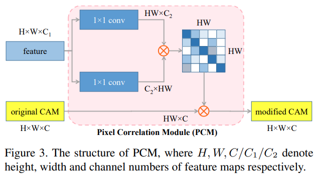

# SEAM - CVPR 2020

---

```{admonition} Information
- **Title:** Self-supervised Equivariant Attention Mechanism for Weakly Supervised Semantic Segmentation, CVPR 2020

- **Reference**
    - Paper : [https://arxiv.org/abs/2004.04581](https://arxiv.org/abs/2004.04581)
    - Code : [https://github.com/YudeWang/SEAM](https://github.com/YudeWang/SEAM)
    
- **Review By:** 김현우 (Kim Hyeonwoo)

- **Last updated on Aug. 16, 2022**

```

## Abstract

- Image-level supervision을 이용한 Weakly-supervised Semantic Segmentation (WSSS)의 대부분은 Class Activation Map (CAM)을 이용한 접근을 사용한다. 하지만, CAM의 경우는 full-supervision과 weak-supervision의 차이로 인해 object mask를 cover 하기에는 문제가 있다.
- 본 논문은  추가적인 supervision의 제공과 full-supervision과 weak-supervision 사이의 차이를 줄일 수 있는 Self-supervised equivariant attention mechanism (SEAM)을 제안함.
    - Semantic segmentation의 경우 spatial transformation에 상관없이 같은 pixel에 일관성 있는 클래스를 가지도록 함 (equivariance)
    - 하지만, 이러한 제약은 image-level을 통해 CAM을 생성할 때 없어지기 때문에 various transformed images에 consistency regularization을 적용하는 방법을 제안함. 이를 통해 transformation에 따라서 CAM의 결과가 달라지지 않도록 regularization을 제공
    - 추가적으로  pixel correlation module (PCM)을 이용하여 다른 픽셀의 정보를 통해서 CAM의 성능을 향상시킴
- PASCAL VOC 2012 dataset에서 SOTA 성능을 달성

## Problem Statement

- 일반적으로, 대부분의 WSSS 방법의 경우는 class activation map (CAM)이라는 효율적으로 image classification labels을 이용하여 class에 따른 object의 영역을 추정하지만, CAM의 attention이 object의 discriminative가 가장 높은 영역에만 생기거나(under-activation), 배경영역에도 attention이 나타나는 (over-activation) 문제점이 있음. (부정확함.)
- 또한 생성된 CAMs은 affine transformations 적용했을 때, 일관성 있는 결과를 보이지 않음.
    
    :::{figure-md} fig-seam1
    

    CComparisons of CAMs generated by input images with different scales. (source: arXiv:2004.04581)
    :::
        
- {numref}`fig-seam1`와 같이 rescaling transformations에 따라서 CAM의 attention region이 변함을 확인할 수 있다. 이러한 현상의 근본적인 원인은 fully and weakly supervision 사이에서 오는 차이에 의해서 발생한다.

## Contribution

- 다양한 Image transformation에 대응하는 consistency regularization을 통해서 self-supervision을 제공하는 self-supervised equivariant attention mechanism (SEAM) architecture를 제안.
    - 네트워크의 예측 일관성을 높이기 위해, pixel correlation module (PCM)을 통해 각 픽셀을 위한 context appearance information를 잡고 학습된 affinity attention maps에 의해서 CAMs을 개선
    - SEAM은 CAMs과 revised CAMs 간의 차이를 최소화하는 equivariant cross regularization (ECR) loss를 통해서 siamese network를 학습.
    - PCM과 self-supervision이 효율적으로 결합되어 over-activated and under-activated regions을 줄임
- PASCAL VOC 2012에서 SOTA를 달성

## Proposed Method

:::{figure-md} fig-seam2


The siamese network architecture of our proposed SEAM method. (source: arXiv:2004.04581)
:::


### 1. Motivation

- Parameter $w_s$를 가지는 semantic segmentation function이 $F_{w_s}(\cdot)$와 parameter $w_c$를 가지는 classification function이 $F_{w_c}(\cdot)$일 때, WSSS에서는 최적의 segmentation과 classification parameter가 $w_s=w_c$를 만족한다는 가정을 기반으로 한다.
- 하지만 segmentation 함수는 **equivariant**에 치중하는 반면, classification은 pooling operation에 의해서 invariance에 치중하는 경향을 나타내기 때문에 학습 과정에서 두 task의 objective를 모두 달성하는 것은 불가능하다.
    - Affine transformation $A(\cdot)$을 각 sample에 적용한다고 가정하면, segmentation function은  equivariant 경향을 나타낸다.
        
        $$
        F_{w_s}(A(I)) = A(F_{w_s}(I)) = s
        $$
        
        여기서 $s$는 pixel-level segmentation mask를 나타낸다.   
        
    - Classification function은 **invariance**에 초점을 맞춘다. 이 특성은 pooling 연산이 주된 요인이다.
    
    $$
    Pool(F_{w_c}(A(I))) = Pool(F_{w_c}(I))
    $$
    
- Self-attention은 network의 성능 개선을 위해 널리 사용되고 있으며, context feature dependency를 통해서 feature map을 개선할 수 있다. Aactivation map을 개선하기 위해 pixels간의 유사도를 이용하는 대부분의 WSSS 방법과 유사한 아이디어라고 할 수 있다.
- 일반적인 self-attention은 다음과 같은 수식으로 표현할 수 있다.
    
    $$
    y_i=\frac{1}{\mathscr{C}(x_i)}\sum_{\forall j}f(x_i,x_j)g(x_j)+x_i
    $$
    
    $$
    f(x_i, x_j)=e^{\theta(x_i)^T \phi(x_j)}
    $$
    
    여기서 $g(x_j)$는 input signal $x_j$의 representation, $f(x_i, x_j)$는 embedding space에서 계산되는 dot-produnct pixel affinity를 나타낸다.  Output signal은 $C(x_i)=\sum_{\forall j}f(x_i, x_j)$를 이용하여 normalize된다. 
    
- 제안된 SEAM구조는 network가 일관적인 결과를 출력할 수 있도록 self-attention을 적용한다.
    
    

---

### 2. ****Equivariant Regularization (ER)****

- Fully supervised semantic segmentation 에서는 data augmentation에 의해 pixel-level labels의 변화가 생기지 않으며, 네트워크에는 implicit한 equivariant regularization이 생긴다.
- 그러나, WSSS는 이미지 레이블을 통해 분류만 하기에 이러한 제약이 없기 때문에 같은 ER loss를 제안함.
    
    $$
    L_{ER} = ||F(A(I))-A(F(I))||_{1}
    $$
    
    여기서 $F$ network, $A$는 rescaling, rotation, flip과 같은 Affine Transformation을 나타낸다.  
    
    → Affine Transformation을 적용한 Image에서 추출한 CAM과 Original Image에서 추출한 CAM에 Affine Transformation을 적용한 CAM 사이의 차이를 최소화함으로서, CAM간의 일관성을 보장함. (ER Loss) 
    

### 3. Pixel Correlation Module (PCM)

- ER Loss가 추가적인 supervision을 제공하지만, classical convolution layers 만으로는 이상적인 equivariance를 이루기 어렵다.
- 이를 해결하기 위해서 self-attention에서 제공하는 context information 이용하여 pixel-wise prediction 결과를 개선한다.

$$
y_i = \frac{1}{C(x_i)}{\sum_{\forall j}e^{\theta(x_i)^T\phi(x_j)}g(\hat{y_j})} + \hat{y_i}
$$

$$
f(x_i, x_j) = \frac{\theta(x_i)^T\theta(x_j)}{||\theta(x_i)||\cdot||\theta(x_j)||}
$$

$$
y_i = \frac{1}{C(x_i)}{\sum_{\forall j}ReLU(\frac{\theta(x_i)^T\theta(x_j)}{||\theta(x_i)||\cdot||\theta(x_j)||})\hat{y_j}}
$$

:::{figure-md} fig-seam3


The structure of PCM. (source: arXiv:2004.04581)
:::

- Final CAM의 경우 original CAM과 normalized similarities을 적용한 CAM을 가중합하여 계산한다.
- 고전적인 self-attention과는 다르게, PCM의 경우 residual connection을 제거해서 original CAM과 같은 강도를 유지한다.
- 다른 네트워크 브랜치는 PCM에 대한 픽셀 수준의 supervision을 제공하지만 이는 ground truth만큼 정확하지 않기 때문에 $\phi, g$ 의 embedding function을 제거해서 파라미터의 수를 줄임으로서 부정확한 supervision에 대한 overfitting을 방지한다.

### ****4. Loss Design of SEAM****

- 제안된 논문은 WSSS 조건에 의해 Image-level classification label $l$ 만 supervision으로 학습에 사용한다.

$$
L = L_{cls} + L_{ER} + L_{ECR}
$$

**(1)** M**ulti-label soft margin loss for Multi-class classification**

- Siamese network의 original CAM, 즉 원본 영상으로부터 구한 CAM $\hat{y}^{o}$와 transformed image에서 구한 CAM $\hat{y}^{t}$ 에 대해 global average pooling(GAP) layer를 도입해서 이미지 분류를 위한 prediction vector $z$를 생성하고, multi-label soft margin loss를 통해서 네트워크를 학습한다.
- 두 branch에 대한 classification loss는 다음과 같이 정의된다.
    
    $$
    \begin{aligned}
    L_{cls} &= \frac{1}{2}(l_{cls}(z^o,l) + l_{cls}(z^t,l)) \\
    &\text{where }l_{cls}(z,l) = -\frac{1}{c} \sum_{c=1}^{C-1}[l_{c}log(\frac{1}{1+e^{-x_c}}) + (1-l_c)log(\frac{e^{-x_c}}{1+e^{-x_c}})]
    \end{aligned}
    $$
    
    여기서 $l_{cls}$ 는  $C-1$ 개의 foreground object category에 대한 classification loss이다. 
    

**(2) ER (Equivariant Regularization) loss**

- (ER) loss는 다음과 같이 정의된다.
    
    $$
    L_{ER} = ||A(\hat{y^o})-\hat{y^t}||_{1}
    $$
    
    여기서 $A(\cdot)$은 transformation branch에서 input image에 대해 적용되는 affine transformation이다. 
    

**(3) ECR (Equivariant Cross Regularization)  loss**

- CAM을 개선하기 위해 두 branch로 구한 CAM에 PCM 모듈을 적용하는데, 실험 결과 학습 과정에서 쉽게 local minima에 빠져 모든 pixels을 동일한 class로 predict하는 문제가 발생했다.
- 이런 문제를 해결하기 위해 ECR loss를 제안한다.
    
    $$
    L_{ECR} = ||A({y^o})-\hat{y^t}||_{1} + ||A(\hat{y^o})-y^t)||_{1}
    $$
    
- PCM의 output은 original CAM에 의해 regularize된다. 이를 통해 PCM refinement 적용중에 CAM이 degeneration되는 것을 방지할 수 있다.

**(4) Background score**

- CAM의 경우는 foregorund class에 대해서 정의되지만, 입력 이미지의 대부분의 경우는 background 를 가지기에 PCM 과정에서 이를 무시할 수 없다.
- 따라서, background positions에 zero vectors를 추가해서 PCM 계산에는 포함하고, gradients는 전파하지 않는다.
    
    $$
    \hat{y}_{i,bkg} = 1 - \max_{1\le c \le {C}}{\hat{y}_{i,c}}
    
    $$
    
    ```python
    # 배경 인덱스 0을 무시하고 계산하는 것을 확인할 수 있음 
    # label = [배경, 개, 고양이]
    loss_cls1 = F.multilabel_soft_margin_loss(label1[:,1:,:,:], label[:,1:,:,:])
    loss_cls2 = F.multilabel_soft_margin_loss(label2[:,1:,:,:], label[:,1:,:,:])
    
    ns,cs,hs,ws = cam2.size()
    loss_er = torch.mean(torch.abs(cam1[:,1:,:,:]-cam2[:,1:,:,:]))
    #loss_er = torch.mean(torch.pow(cam1[:,1:,:,:]-cam2[:,1:,:,:], 2)) <- 
    cam1[:,0,:,:] = 1-torch.max(cam1[:,1:,:,:],dim=1)[0]
    cam2[:,0,:,:] = 1-torch.max(cam2[:,1:,:,:],dim=1)[0]
    
    tensor_ecr1 = torch.abs(max_onehot(cam2.detach()) - cam_rv1)#*eq_mask
    tensor_ecr2 = torch.abs(max_onehot(cam1.detach()) - cam_rv2)#*eq_mask
    loss_ecr1 = torch.mean(torch.topk(tensor_ecr1.view(ns,-1), k=(int)(21*hs*ws*0.2), dim=-1)[0])
    loss_ecr2 = torch.mean(torch.topk(tensor_ecr2.view(ns,-1), k=(int)(21*hs*ws*0.2), dim=-1)[0])
    loss_ecr = loss_ecr1 + loss_ecr2
    
    loss_cls = (loss_cls1 + loss_cls2)/2 + (loss_rvmin1 + loss_rvmin2)/2 
    loss = loss_cls + loss_er + loss_ecr
    ```
    

## Experiments

### 1. **Implementation Details[¶](https://pseudo-lab.github.io/SegCrew-Book/docs/ch4/04_01_01_AffinityNet.html#implementation-details)**

- Dataset:  PASCAL VOC 2012 Benchmark (20 foreground objects and the background)
- Data augmentation
    - SBD additional annotations [14] 를 적용하여 10582 images로 구성된 training set을 사용
- Backbone
    - ResNet38 (output stride =8, 3,4번째 stage에서 feature map 추출하고 1x1 conv.를 통해 각각 64, 128 ch로 변환

### 2. Ablation Study

- Baseline과 비교한 결과 제안한 방법이 더 높은 mIoU를 나타냄을 확인하였고, SEAM을 이용하여 CAM을 생성한 결과 GradCAM보다 높은 성능을 확인할 수 있다.

```{image} pic/seam/seam4.png
:alt: seam4.png
:class: bg-primary mb-1
:align: center
:width: 400
```

- ****Improved Localization Mechanism:****

```{image} pic/seam/seam5.png
:alt: seam5.png
:class: bg-primary mb-1
:align: center
:width: 400
```

- 다양한 ****Affine Transformation에 대해 ER 방법의 효과를 검증한 결과 rescale만 단독 사용한 것이 가장 효과적임을 확인할 수 있다. (flip, rotation 등의 annotation을 함께 적용한 결과 성능 개선이 적음)****

```{image} pic/seam/seam6.png
:alt: seam6.png
:class: bg-primary mb-1
:align: center
:width: 400
```

- ****Augmentation and Inference:****
    - Baseline의 rescaling 범위를 확장해도 pseudo label performance가 개선되지 않음.
    →  ER과 PCM의 조합이 annotation의 효과가 아님을 알 수 있다.  (Table 4)
    - Inference 과정에서 **다른 스케일의 이미지에서 prediction을 aggregating하여 multi-scale test를 수행한 결과 baseline 대비 개선된 성능을 나타냄. (Table 5)**

```{image} pic/seam/seam7.png
:alt: seam7.png
:class: bg-primary mb-1
:align: center
:width: 400
```

- 제안된 SEAM이 baseline 대비 낮은 mFN과 mFP을 나타냄을 알 수 있음. overactivated된 baseline CAM에 비해 object region을 잘 activation한다고 할 수 있다.
- Image scale의 변화에 따라 mFN과 mFP의 변화가 존재하는 baseline 대비 제안된 SEAM은 일정한 수치를 나타내는 것을 확인할 수 있음. 이는 equivariance regularization이 network 학습 과정에서 효과를 나태네어 CAM을 개선한 것으로 해석할 수 있다.

```{image} pic/seam/seam8.png
:alt: seam8.png
:class: bg-primary mb-1
:align: center
:width: 400
```

(****3) Comparison with State-of-the-arts****

```{image} pic/seam/seam9.png
:alt: seam9.png
:class: bg-primary mb-1
:align: center
:width: 800
```

```{image} pic/seam/seam10.png
:alt: seam10.png
:class: bg-primary mb-1
:align: center
:width: 800
```

```{image} pic/seam/seam11.png
:alt: seam11.png
:class: bg-primary mb-1
:align: center
:width: 400
```

## ****Conclusion****

- In this paper, we propose a self-supervised equivariant attention mechanism (SEAM) to narrow the supervision gap between fully and weakly supervised semantic segmentation by introducing additional self-supervision
- The SEAM embeds self-supervision into weakly supervised learning framework by exploiting equivariant regularization, which forces CAMs predicted from various transformed images to be consistent.
- To further improve the ability of network for generating consistent CAMs, a pixel correlation module (PCM) is designed, which refines original CAMs by learning inter-pixel similarity
- Our SEAM is implemented by a siamese network structure with efficient regularization losses. The generated CAMs not only keep consistent over different transformed inputs but also better fit the shape of ground truth mask
- The segmentation network retrained by our synthesized pixel-level pseudo labels achieves state-of-the-art performance on PASCAL VOC 2012 dataset, which proves the effectiveness of our SEAM.