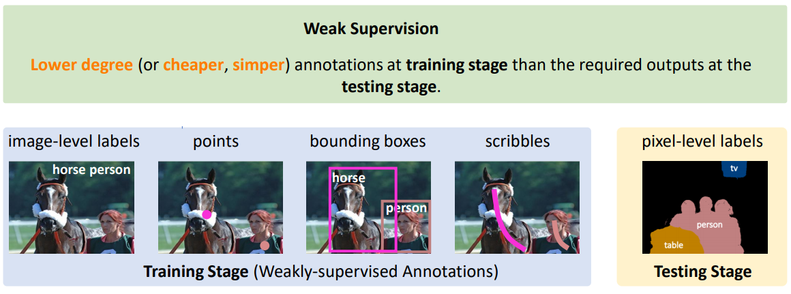
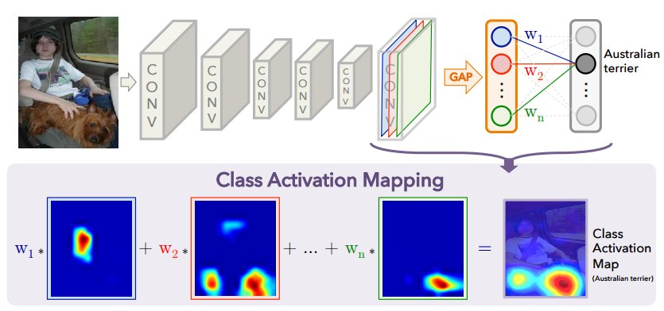
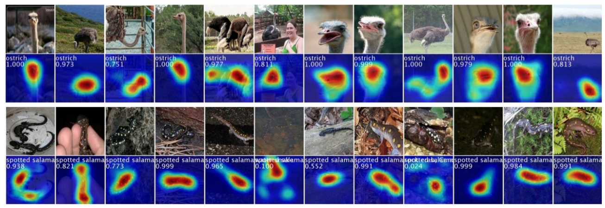
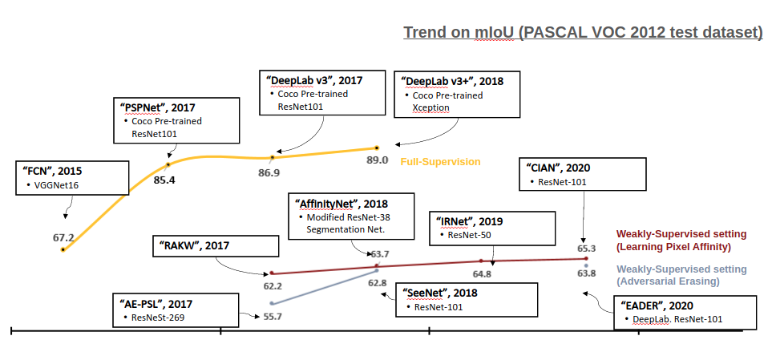

# 04. Weakly-supervised Segmentation

## Introduction

:::{figure-md} markdown-fig

Weakly supervised learning. (source: Hakan, CVPR18 Tutorial)
:::

- Weakly-supervised learning은 full supervision이 아닌 완벽하지 않은 저수준(lower degree, noisy, limited, or imprecise sources)의 supervision 이용하여 학습방법이다.
- Segmentation task의 경우 supervised leaning 기반 학습 setting에서는 학습데이터로 주어진 모든 영상 정보에 대해 pixel level의 class label이 필요하며, 이러한 고수준의 labeled data가 필요한 task에서 data를 확보하는 과정에서 다음과 같은 문제가 발생할 수 있다.
    
    (1) 충분한 양의 labeled data를 확보하기 어렵다.

    (2) 특정 task의 경우 label data 생성에 전문가가 필요하고, 이는 많은 비용과 노력을 필요로 한다. (e.g.의료 영상)

    (3) 충분한 Data를 수집하기 위한 시간이 많이 든다.
    
- Weakly supervised learning 기반 방법에서는 영상 전체의 classification 결과 (class label), 또는 object detection 결과 (bounding box, class label)와 같은 full supervision 대비 저수준의 labeled data를 이용하여 semantic/instance segmentation task와 같은 고수준의 task를 수행하는 network를 학습한다. 이를 통해 data 수집에 필요한 비용과 시간을 절감할 수 있다.
- Pixel/instance level의 label이 확보되지 않는 weakly supervised setting에서는 Class attention map (CAM)을 주로 활용한다.

:::{figure-md} markdown-fig

Class Attention Map (source: Learning Deep Features for Discriminative Localization, CVPR 2016)
:::

- CAM은 Network가 image를 특정 class로 prediction하게 하는 feature 내의 위치 정보를 표현한다.
- 마지막 conv. layer의 output feature map $f^{\text{CAM}}$ 특정 class로 분류될 activation value를 구하기 위한 weight와 weighted sum을 수행하여 CAM을 도출한다.

- 이러한 CAM 정보는 class label만이 주어진 환경에서 이미지 내에 객체가 어디에 속한지 알려주지만 Classification을 위한 network에서 특정 object에서 나타나는 특정한 pattern에 대해 score가 학습이 되므로, 다양한 training sample에서 공통적으로 나타나는 scene들에 대해서 score가 낮게 학습이 된다. 

- 즉 배경과 잘 구분되는 object와 같이 discriminate한 부분에 집중하여 학습이 되므로, sparse하고 blurrly한 정보를 포함하고 있으며, score가 object의 외각영역에 집중되는 경향이 있다. 

:::{figure-md} markdown-fig

Examples of Class Attention Map (source: Weakly Supervised Object Detection, ECCV Tutorial 2020)
:::
        
- 이를 해결하기 위해 다양한 기법의 weakly supervised learning 기법이 제안되었고, 이를 분류해보면 다음과 같다.
    
    (1) Seeded Region Growing
    
    (2) Adversarial Erasing
    
    (3) Learning Pixel Affinity
    
    (4) Sailency or Attention Mechanism
    
+++ {"meta": "data"}

## Trend

 :::{figure-md} markdown-fig

Evolution of weakly-supervised semantic segmantation
:::

+++

 - 본 chapter에서는 위 분류에 속한 다양한 weakly-supervised learning 기반 segmentation 연구결과를 리뷰한다.

*Latest update: Jan 6, 2022*