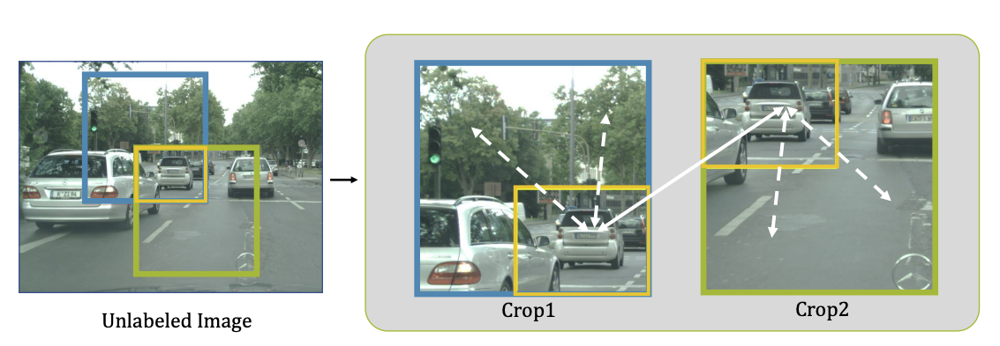
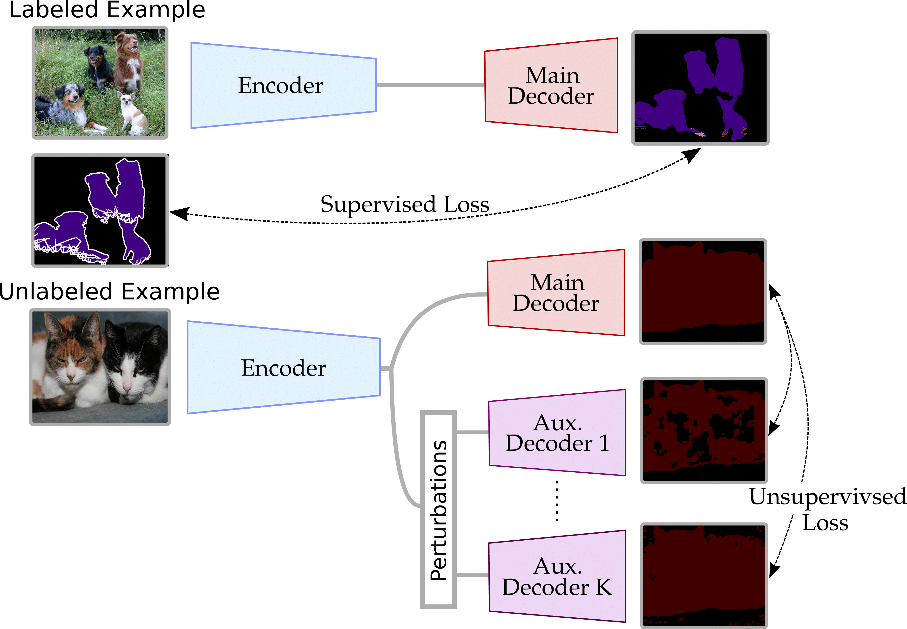

# [Draft] Semi-supervised Semantic Segmentation with Directional Context-aware Consistency - CVPR 2021

Title: Semi-supervised Semantic Segmentation with Directional Context-aware Consistency

Review By: Chanmin Park

Edited by: Taeyup Song


## Reference

- paper : [https://jiaya.me/papers/semiseg_cvpr21.pdf](https://jiaya.me/papers/semiseg_cvpr21.pdf) (CVPR 2021)
- code : [https://github.55860.com/dvlab-research/Context-Aware-Consistency](https://github.55860.com/dvlab-research/Context-Aware-Consistency)

## Problem statement

- full label을 생성하기에 time-consuming이 많이 듬
- 기존의 supervised learning은 적은 data로 인해서 overfitting이 많이 일어남 (Fig. 1 참조)

:::{figure-md} markdown-fig


grad cam으로 visualization을 한 결과 (1/8 의 label만 사용함)
:::

- 기존의 segmentation은 receptive field의 한계로 인해서 context information에 대해서 학습을 하지 않음.

## Contribution

:::{figure-md} markdown-fig


Crop1 and Crop2 are randomly cropped from the same image with an overlapping region.
:::

- 위의 그림과 같이 label이 있는 부분을 overlapping을 해서 patch데이터간의 consistency 를 주어지며 이른 context aware consistency라고 명시함
- contextual alignment를 주기 위해서 directional contrastive loss를 제시함 이는 pixel wise로 cosine similarity 주게 되는 방법을 의미함.
- 데이터의 sampling 하는 새로운 방법을 제시함으로 negative sample와 ambiguous한 postive sample을 filtering함

## Related work

- semi supervised 의 대표적인 방법중에 하나 permutation 다양하게 주게됨으로 invaraince를 높임
- weakly label이 필요없음

:::{figure-md} markdown-fig


figure from ..
:::


## Proposed Method

### 1. motivation

:::{figure-md} markdown-fig


Visual comparison between contextual augmentation (I and II) and low-level augmentation (I and III)
:::

- 노란색으로 되어진 overlapping region에서 weak augmentation (gaussian noise, color jitter) 했을때와 다른 위치의 patch를 구헀을때의 이미지임
- 두번째 행에서 보는 바와 feature에서 T-SNE를 적용하면 weak augmentation에서는 feature space가 전혀 바뀌지 않음.

### 2 Network

:::{figure-md} markdown-fig


Overview of framework
:::

- label,target image, unlabel image: $y_t ,x_t,x_u$
- overlapping image(w/label),non overlapping image(wo/label) : $x_{u1},x_o,x_{u2}$
- project feature : $\varPhi$

### 2.1 Context-aware Consistency

- low level feature projection을 시킨후 upsacaling을 한결과를 label의 영역간의 pixel wise constrative loss를 적용시켜줌
- 저자는 low level에서 feature를 projection을 시키면 좀더 context에 대해서 학습할수있다고 ablation result를 통해서 보여줌

### 2.2 Directional Contrastive loss(DC loss)

- 기존의 contrastive loss의 경우 MSE를 적용하여주었지만 저자는 cosine simliarity를 통해서 문제를 접근함.
    
    :::{figure-md} markdown-fig
    

    Comparison between vanilla CL and DCL
    :::
    
    $$l_{dc}^{b}(\phi_{o_1},\phi_{o_2})=-\frac{1}{N}\sum_{h,w}\mathcal{M}_{d}^{h,w}\cdot\log\frac{r(\phi_{o_1}^{h,w},\phi_{o_2}^{h,w})}{r(\phi_{o_1}^{h,w},\phi_{o_2}^{h,w})+\sum_{\phi_n \in \mathcal{F_u}}r(\phi_{o_1}^{h,w},\phi_{n})}$$
    
    $$\mathcal{M}_{d}^{h,w}=\mathbf{1}\{\max C(f_{o_1}^{h,w}<\max C(f_{o_2}^{h,w})\}$$
    
    $$\mathcal{L}_{dc}^b=l_{dc}^b(\phi_{o_1},\phi_{o_2})+l_{dc}^b(\phi_{o_2},\phi_{o_1})$$

    :::{figure-md} markdown-fig
    

    Cosine similarity
    :::

- 식에서 있듯이 overlapping이 된 영역끼지의 cosine  similarity를 loss를 줄여줌
- 반면에 negative pair에 관해서는 분모로 두어서 더 similarity를 멀게 만듬
- $M_d^{h,w}$ 같은 경우 pixel단위로 target되어지는 pixel이 source pixel보다 크면 loss를 계산함.

### 2.3 sampling Strategies

- negative pair의 양을 조절해야되기때문에 pseudo label에서 negative의 prediction을 값을 통해서 filtering을 함
    
    $$\tilde{y}_{ui}=\arg\max C(f_{ui}) \ \ \ i \in \{1,2\}$$
    
    $$l_{dc}^{b,n,s}(\phi_{o_1},\phi_{o_2})=-\frac{1}{N}\sum_{h,w}\mathcal{M}_d^{h,w}\cdot\log\frac{r(\phi_{o_1}^{h,w},\phi_{o_2}^{h,w})}{r(\phi_{o_1}^{h,w},\phi_{o_2}^{h,w})+\sum_{\phi_n \in \mathcal{F_u}}\mathcal{M}_{n,1}^{h,w}\cdot r(\phi_{o_1}^{h,w},\phi_{n})}$$
    
- Positive 에서도 prediction의 낮은 값의 경우 $\gamma$를 통해서 filtering을 적용하여줌

$$l_{dc}^{b,ns,pf}(\phi_{o_1},\phi_{o_2})=-\frac{1}{N}\sum_{h,w}\mathcal{M}_{d,pf}^{h,w}\cdot\log\frac{r(\phi_{o_1}^{h,w},\phi_{o_2}^{h,w})}{r(\phi_{o_1}^{h,w},\phi_{o_2}^{h,w})+\sum_{\phi_n \in \mathcal{F_u}}\mathcal{M}_{n,1}^{h,w}\cdot r(\phi_{o_1}^{h,w},\phi_{n})}$$

$$\mathcal{M}_{d,pf}^{h,w}=\mathcal{M_d^{h,w}}\cdot\mathbf{1}\{\max C(f_{o_2}^{h,w})>\gamma\}$$

- 이러한 방법들을 바탕으로 CAM을 통해서 weak-superivsed도 문제를 접근할수 있음

### Experimnets

```{image} pic/semicontext/semicontext12.png
:alt: context12.png
:class: bg-primary mb-1
:align: center
```

```{image} pic/semicontext/semicontext13.png
:alt: context13.png
:class: bg-primary mb-1
:align: center
```

```{image} pic/semicontext/semicontext14.png
:alt: context14.png
:class: bg-primary mb-1
:align: center
```

```{image} pic/semicontext/semicontext15.png
:alt: context15.png
:class: bg-primary mb-1
:align: center
```

```{image} pic/semicontext/semicontext16.png
:alt: context16.png
:class: bg-primary mb-1
:align: center
```

