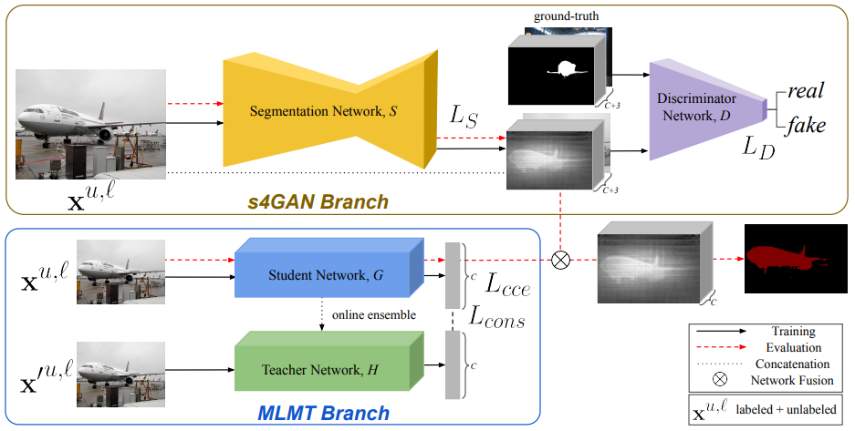
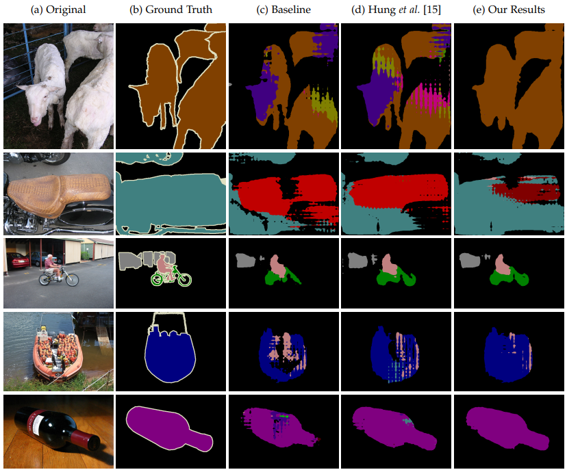
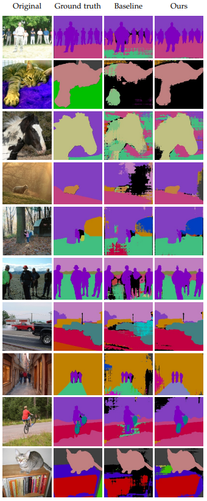
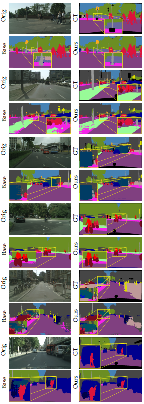
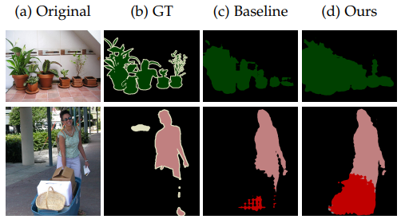
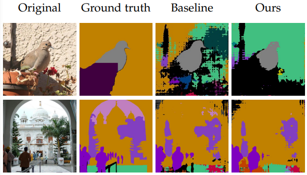
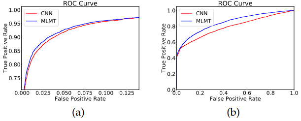

# s4GAN - arXiv:1908.05724

---

```{admonition} Information
- **Title:** Semi-Supervised Semantic Segmentation with High- and Low-level Consistency, ICCV 2019

- **Reference**
    - paper : [https://arxiv.org/abs/1908.05724](https://arxiv.org/abs/1908.05724)
    - code : [https://github.com/sud0301/semisup-semseg](https://github.com/sud0301/semisup-semseg)
    
- **Review By:** 김소연 

- **Edited by:** Taeyup Song

- **Last updated on Jan. 5, 2022**
```

## Abstract

- 수량이 제한된 pixel-wise annotated samples (labeled dataset)과 추가적인 annotation-free images(unlabeled dataset)을 이용하여 학습.
- Self-training을 포함한 Semi-supervised learning 기반 classification network와 segmentation network가 연동되는 구조를 제안.
- 아주 적은 수의 labeled samples를 이용한 학습 과정에서 발생할 수 있는 low/high-level artifacts를 줄이기 위한 Dual-branch approach
- PASCAL VOC 2012, PASCAL-Context, and Cityscapes에서 semi-supervised learning 기법 중 SOTA 달성

## Problem Statement

limited data로 학습된 CNN이 두 가지 failure mode를 가질 수 있음

- Low-level detail이 부정확함 (틀린 object shape, 부정확한 boundary, 말이 안되는 surfaces)
- Misinterpretation of high-level information (figure 1. (d), 이미지의 많은 영역을 틀린 class로 예측하는 경우)
    
:::{figure-md} markdown-fig


(a) PASCAL VOC dataset, (b) GT, (c) 5%만 가지고 supervised 방식으로 학습한 결과, (d) 95% unlabeled 데이터 가지고 제안된 GAN 기반의 branch로 shape estimation을 향상시킨 결과, (e) second branch가 false positive를 없앰으로써 high-level consistency를 가져온 결과, (f) 100% 전체로 학습한 결과 (source: arXiv:1908.05724)
:::

## Proposed Method

- High/low-level artifacts에 각각 대응하기 위한 Two network branch architecture 제안
    1. low-level artifacts에 대응하기 위한 improved GAN-based model
        - Segmentation network를 generator로 사용
        - Discriminator는 생성된 segmentation map과 GT를 classify
        - 기존의 GAN loss를 사용하지 않고, **feature matching loss**를 사용함
        - discriminator score 기반의 self-training procedure 사용하여 최종 성능 향상
            - leveraging high-quality generator predictions as fully labeled samples
    2. high-level artifacts에 대응하기 위한 semi-supervised multi-label classification branch
        - 이미지 내 classes를 예측함으로써 segmenation network가 globally consistent decisions를 할 수 있도록 도움
        - Extra image-level information from unlabeled images을 사용하기 위해 we leverage the success of ensemble-based semi-supervised
- 두 branch가 상호 보완적으로 low & high-level error에 대응함을 확인 (Fig1 (e))

# Related Work

### (1) Weakly-supervised and Semi-supervised Segmentation

- Weakly-supervised segmentation : image-level class labels, bounding boxes, scribble 사용
- Semi-supervised segmentation : a few pixel-wise segmentation labels 추가로 사용
- True semi-supervised segmentation learning을 사용한 방법
    - 완전히 annotation-free images를 사용해서 성능 향상
    - [[Souly, ICCV 2017]](https://openaccess.thecvf.com/content_ICCV_2017/papers/Souly__Semi_Supervised_ICCV_2017_paper.pdf) : Segmentation network에서 학습하는 features를 강화하기 위해 추가 이미지를 생성하는데에 GAN 적용. 추가로 additional class-conditional images를 생성함으로써 semi-supervised method를 확장함
    - [[Hung, BMVC 2018]](https://arxiv.org/abs/1802.07934) : GAN 기반 디자인으로 unlabeled samples로부터 학습가능하도록 함. 여기서는 Discriminator로 FCN-based 모델을 사용해서 **픽셀 별로 dense probabilistic map**을 만들어 낸다. (→s4GAN은 **image-wise discriminator**를 제안)
    - 두 방법 모두 s4GAN과 같이 GAN 기반 모델 사용했지만 GAN을 다르게 사용함
- [[Luc, NIPS workshop 2014]](https://arxiv.org/abs/1611.08408) :
    - CRF 후처리 대신에 GAN을 사용해서 segmentation map에서 low-level consistency를 강화시킴. (semi-supervised learning 방식이 아님)
    - 기존 GAN loss를 사용해서 predicted segmentation map이 GT map과 유사하도록 학습하고, 이것이 fully-supervised setting에서 성능을 향상시킬 수 있음을 보임

### (2) Semi-supervised Classification

- segmentation과 달리 Classification 위한 semi-supervised 방법론들은 많음
- 그러나 real-world conditions를 설명할 realistic evaluation이 부족하다.
- consistency-based semi-supervised classification
    - high quality supervised baseline보다 성능 향상
    - pretrained network using unlabeled data보다 향상
- **제안된 s4GAN은 Mean-Teacher method 적용**

### (3) Network Fusion

- Fuse spatial and class information by channel-wise selection 하는 방식 많이 제안됨.
- [[Hu, TPAMI 2018]](https://arxiv.org/abs/1709.01507) : calibrating channel-wise feature maps함으로써 spatial and channel-wise information을 combine
- [[Hong, NIPS 2015]](https://arxiv.org/abs/1506.04924), [[Wei, CVPR 2017]](https://arxiv.org/abs/1703.08448), [[Wei, CVPR 2018]](https://arxiv.org/abs/1805.04574) : semi- and weakly supervised semantic segmentation에서 classification 사용 유무를 실험함으로써 class information 영향을 실험함
- **s4GAN은 spatial과 class information을 decouple해서 late fusion 함으로써 false positive class channels를 제거함.**

## Proposed Method

:::{figure-md} markdown-fig


s4GAN branch는 gan 기반의 모델로 low-level detail을 잘 잡아준다. MLMT branch는 semi-supervised multi-label classification을 수행해서 class-level information을 사용해서 false-positive prediction을 segmentation map에서 없애준다. (source: arXiv:1908.05724)
:::

- Lower branch : predicts `pixel-wise class labels = s4GAN` (semi-supervised semantic segmentation)
    - Standard segmentation network 사용
    - 제안된 방법은 기존의 supervised training과 adversarial training을 결합하느 구조를 적용하여, unlabeled data를 이용하여 prediction quality를 개선함.
    - segmentation network가 generator로서 discriminator와 함께 학습되어 labeled data의 ground truth segmentation map과 generated된 segmentation map을 구별함
    - 추가적으로 **discriminator의 output을 quality measure**로 사용하고, **best prediction을 identify**하는 데에 사용하여 더 나아가 **self-training**을 한다.
- Upper branch : performs `image-level classification = MLMT` (multi-label mean teacher)
    - image-level class label을 예측해서 s4GAN의 output을 filter해줌
    - Mean Teacher classifier를 적용하여 효과적으로 false positive predictions를 제거함.
- 두 branches가 상호 보완적으로 동작함.

### (1) s4GAN for Semantic Segmentation

:::{figure-md} markdown-fig


s4GAN branch (source: arXiv:1908.05724)
:::

- segmentation network $S$ : generator로 이미지 x를 받아서 $C$개의 segmentation maps를 만들어낸다. ($C$: 클래스 수)
- Discriminator $D$: concatenated input of original image and corresponding predicted segmentation을 받아서 real segmentation map의 distribution statistics와 비교

**A: Training Segmentation Network $S$**

- Segmentation network를 학습하기 위한 loss $L_s$는 다음과 같다.
    
    $$L_s = L_{ce} + \lambda_{fm}L_{fm}+\lambda_{st}L_{st}$$
    
- Labeled data에 대해 Cross-entropy loss $L_{ce}$ 을 적용한다.
    
    $$L_{ce} = - \sum_{k,w,c}{y^l(h,w,c)\log S(x^l)(h,w,c)}$$
    
    여기서 $y^l(h,w,c)$는 ground truth segmentation map을 $S(x^l)(h,w,c)$는 Segmentation network의 output이다.
    
- Unlabeled data에 대해서는 the feature statistics of the 예측값의 feature statistics과 ground truth segmentation map간의 mean discrepancy를 최소화 하도록 설계된 Feature matching loss $L_{fm}$를 적용한다.
    
    $$L_{fm} = ||E_{(x^l,y^l)\sim D^l}[D_k(y^l\oplus x^l)] - E_{x^u\sim D^u}[D_k(S(x^u)\oplus x^u)]||$$
    
    여기서 $D_k$는 discriminator network의  $k^{th}$ layer 이후의 intermediate representation이다. 
    
    GT와 predicted segmentation masks 모두 해당하는 이미지랑 concat되며, generator가 GT와 같은 feature statistics를 가지는 segmentation map을 예측하도록 한다.
    
- Self-training loss $L_{st}$
    
    $$L_{st} = 
    \begin{cases} -\sum_{h,w,c} y^* \log S(x^u), \space & if \ \  D(S(x^u)) \ge \gamma \\ 0, & \text{otherwise}
    \end{cases}$$
    
    여기서 $\gamma$는 confidence threshold, $y^*$은 prediction $S(x^u)$로부터 생성된 pseudo pixel-wise labels이다.
    
    - GAN 학습에선 discriminator와 generator의 balance가 중요하다. (training 초기에는 discriminator가 너무 강력하게 작용함)
    - Unlabeled 이미지에서 discriminator를 속일 수 있는 가장 좋은 generator outputs을 선택해서 supervised training에 사용함.
    - Discriminator의 output (0(가짜) 1(진짜))를 예측된 segmentation 결과의 quality를 나타내는 confidence measure로 사용한다. (높은 quality라 하면 supervised training에 사용됨 
    → cross entropy loss 계산

**B: Traning Discriminator $D$**

- original GAN objective로 학습됨
    
    $$L_D = E_{(x^l,y^l)\sim D^l}[\log D(y^l \oplus x^l)] + E_{x^u \sim D^u}[\log(1-D(S(x^u) \oplus x^u)]$$
    
    여기서 $\oplus$은 concatenate 연산이다.
    

### (2) Multi-label Semi-supervised Classification: Multi-Label Mean Teacher(MLMT)

:::{figure-md} markdown-fig


MLMT branch (source: arXiv:1908.05724)
:::

- Ensemble-based semi-supervised **classification** method (Mean Teacher)를 semi-supervised **multi-label** image classification으로 확장함
- Student network $G$와 teacher network $H$로 구성됨.
    
    $$L_{MT} = -\sum_c z^l(c)log(G_\theta(x^l)(c)) + \lambda_{cons}||G_\theta(x^{(u,l)})-H_{\theta'}(x'^{(u,l)})||^2$$
    
    여기서 $x$와 $x'$는 각각 student와 teacher network를 위해 다르게 augment된 이미지이며, $z^l$는 multi-hot vector for GT class labels이다. 
    
    - 입력 영상에 영상에 서로 다른 small perbutation이 적용된 영상을 각 network에 입력함.
    - Teacher network의 weight $\theta'$ 은 student network's weight $\theta$ 의 exponential moving average로 적의
    - consistency loss를 사용해서 student model의 prediction과 teacher model의 prediction이 일치되도록 학습한다. (consistency loss : MSE between two predictions)
    - Labeled samples $x^l$에 대해 categorical cross-entropy loss $L_{cce}$를 적용하고, 모든 가능한 samples $(x^{u,l})$에 대해서 consistency loss $L_{cons}$를 사용해서 student network를 optimize한다.

### (3) Network Fusion

- 두 branches는 별개로 학습된다.
- Evaluation할 때는 output of the classification branch에서 input image에 없는 클래스에 해당하는 segmentation map 부분을 단순히 지운다.
    
    $$S(x)_c = \begin{cases} 0 \ &if \ G(x_c) \le \tau \\ S(x)_c \ &\text{otherwise} \end{cases}$$
    
    - $S(x)_c$ : segmentation map for class c
    - $G(x)_c$ : soft output of MLMT-branch
    - $\tau = 0.2$ : threshold on soft output obtained by cross-validation

# Experiment

### (1) Setting

- Datasets
    - PASCAL VOC 2012 segmentation benchmark
    - PASCAL-Context dataset
    - Cityscapes dataset
- Network configuration
    - semi-supervised segmentation GAN
        - DeepLabv2를 main segmentation network로 사용
        - discriminator
            - 4개의 convolution layers로 구성된 standard binary classification network → global average pooling → fully connected layer
            - global average pooling의 결과물을 feature matching loss 계산하는데 사용
    - semi-supervised multi-label classification network
        - ResNet 101 pretrained on ImageNet as base
- Baselines
    - compare to the DeepLabv2 network as the fully-supervised baseline approach, which was trained only on the labeled part of the dataset
    - main semi-supervised baseline은 [15] : use a two-stage GAN training

### (2) Results

- PASCAL VOC 2012, PASCAL-Context, Cityscapes로 실험 결과 기존 SSL 기반 방법들에 성능이 향상됨을 확인할 수 있고, semi-supervised semantic segmentation에서도 new SOTA를 달성함.

:::{figure-md} markdown-fig


Semi-supervised Semantic Segmentation: 제안하는 SSL을 사용해서 baselines보다 더 잘 예측함. 특히 5% 미만으로 labeled data를 사용했을 때 성능 향상이 큼 (a): pretraining 없이 PASCAL VOC 에 대한 성능, (b) COCO pre-training 하고 한 것 (source: arXiv:1908.05724)
:::

- 특히 2% labeled data에서 SOTA (Deeplabv2) 대비 11% 성능 향상을 가져옴
- 추가적으로 extra image-level weak annotations이 있을 때 이를 쉽게 적용할 수 있을 것이라 기대할 수 있음.

### (3) **PASCAL VOC**

- COCO pre-train 여부와 관계없이 제안된 Semi-supervised segmentation model이 모든 labeled data setting에서 가장 좋은 성능을 나타냄.

```{image} pic/s4GAN/s4GAN6.png
:alt: s4GAN6.png
:class: bg-primary mb-1
:width: 400
:align: center
```

- Deeplabv3+ backbone으로 적용 시 Low-data supervised only 세팅에서 unstable함. 데이터가 충분한 경우 Deeplab v2 대비 성능이 개선됨.
- 제안된 semi-supervised model에서는 Deeplabv3+을 사용한 경우가 더 좋은 성능 나타냄.

```{image} pic/s4GAN/s4GAN7.png
:alt: s4GAN7.png
:class: bg-primary mb-1
:width: 400
:align: center
```

:::{figure-md} markdown-fig


PASCAL VOC의 5% labeled data만으로 COCO pre-training 없이 학습한 결과 (source: arXiv:1908.05724)
:::

- PASCAL context 데이터셋으로 1/8 labeled data로 학습한 결과.1/8 label을 이용하여 supervision으로 학습한 baseline에 비해 많이 향상된 결과를 확인 가능함.

:::{figure-md} markdown-fig


PASCAL context 데이터셋으로 1/8 labeled data로 학습한 결과 (source: arXiv:1908.05724)
:::

- COCO pretraining 없이 Cityscapes 데이터셋에서 1/8 labeled data로 학습한 결과 1/8 label을 이용하여 supervised learning으로 학습한 baseline 대비 향상된 결과를 볼 수 있다.


:::{figure-md} markdown-fig


COCO pretraining 없이 Cityscapes 데이터셋으로 1/8 labeled data로 학습한 결과. (source: arXiv:1908.05724)
::: 

### (4) Ablation Studies: MLMT 효과 분석

- MLMT를 적용한 결과 baseline 대비 false-positive가 제거됨을 확인할 수 있음.(fig 7. (d))
- s4GAN을 적용한 결과 작은 shape을 더 잘 포착함을 확인할 수 있음 (fig 7. (e))
- s4GAN이랑 MLMT 합쳤을 때 low and high-level artifacts를 효과적으로 제거함을 확인 (fig 7. (g))

:::{figure-md} markdown-fig


PASCAL VOC 5%만 사용하여 학습한 실험에 대한 ablation study. (source: arXiv:1908.05724)
::: 

### (5) Ablation Studies: Failure cases

- multiple objects가 있는 경우, foreground object가 명확하지 않은 경우??

:::{figure-md} markdown-fig


Failure cases (source: arXiv:1908.05724)
::: 

:::{figure-md} markdown-fig


 PASCAL-Context의 1/8만 사용한 Failures (source: arXiv:1908.05724)
::: 

:::{figure-md} markdown-fig


 Cityscapes의 1/8만 사용한 Failures (source: arXiv:1908.05724)
::: 

### (6) Ablation Studies: Discriminator

- Self-training loss를 포함하여 학습한 경우 Discriminator가 overly strong해지는 걸 막아서 학습이 더 잘된다.

:::{figure-md} markdown-fig


Discriminator output의 변화. (source: arXiv:1908.05724)
::: 

- 5% labeled data를 이용한 setting에서 ImageNet pre-train을 사용하지 않은 경우 Mean Teacher기반 classification network가 특히 false positives를 더 잘 없애줌을 확인 가능

:::{figure-md} markdown-fig


(a) 5%a만 이용하여 CNN-based classification한 결과와 MT-based semi-supervised classification 결과의 ROC curve 비교. (b)는 ImageNet pre-training 없이 동일하게 비교.  (source: arXiv:1908.05724)
::: 
